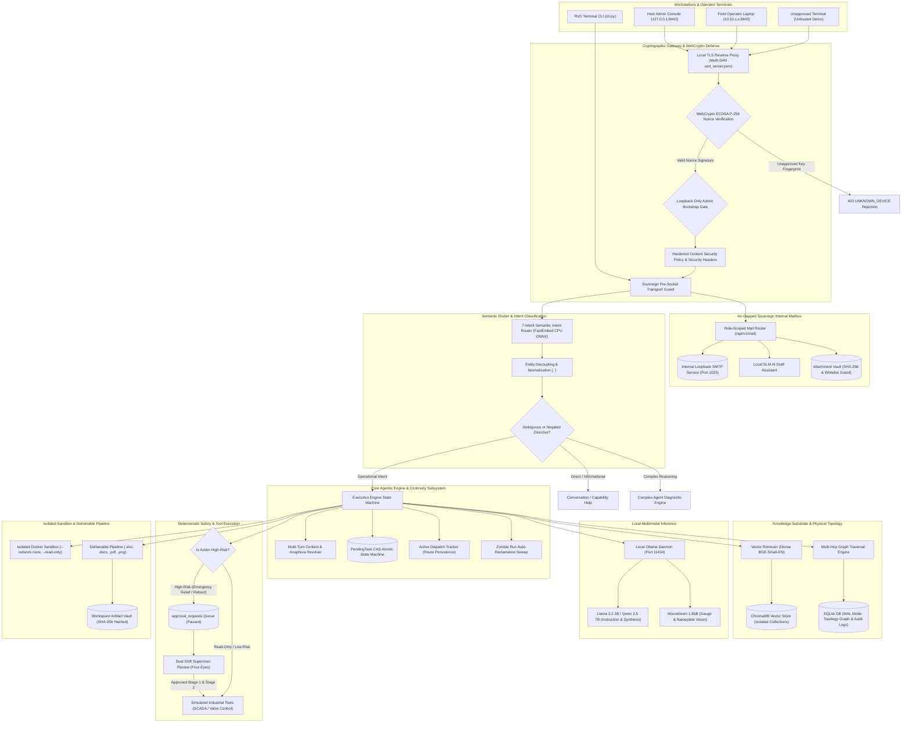

# CogniShift: Sovereign On-Premise Agentic AI Workbench for Industrial Operations

[](https://www.sih.gov.in/)
[](https://www.mrpl.co.in/)
[](https://www.python.org/)
[](https://fastapi.tiangolo.com/)
[](frontend/)
[](https://ollama.com/)
[-darkred.svg)](https://ollama.com/)
[](https://github.com/qdrant/fastembed)
[-lightgrey.svg)](https://www.trychroma.com/)
[-003B57.svg)](https://sqlite.org/)
[](tests/)
[]()
[-informational.svg)]()

**CogniShift** is an enterprise-grade, sovereign on-premise agentic AI workbench engineered for critical industrial processing plants, refineries, and air-gapped infrastructure. It executes open-weight language, vision, and embedding models 100% locally on edge workstations without external cloud dependencies. Outbound egress is cryptographically and architecturally gated; device identities are anchored to browser WebCrypto private keys; and physical plant control tools are bound to strict Human-in-the-Loop Four-Eyes dual-authorization interlocks.

Engineered for the Smart India Hackathon problem statement **SIH26117** in collaboration with **Mangalore Refinery and Petrochemicals Limited (MRPL)**.

---

## Table of Contents

1. [Why CogniShift Exists](#why-cognishift-exists)
2. [Core Architectural Pillars](#core-architectural-pillars)
3. [End-to-End System Architecture](#end-to-end-system-architecture)
4. [Multi-Terminal LAN Deployment & Hardware-Bound Device Security](#multi-terminal-lan-deployment--hardware-bound-device-security)
5. [Air-Gapped Sovereign Internal Mailbox System](#air-gapped-sovereign-internal-mailbox-system)
6. [Operator Command Console Hardening & Real-Time Ergonomics](#operator-command-console-hardening--real-time-ergonomics)
7. [Visual Ergonomics, Theme Engine & Touchscreen Accessibility](#visual-ergonomics-theme-engine--touchscreen-accessibility)
8. [Deep Dive: Core Engine Subsystems](#deep-dive-core-engine-subsystems)
   - [8.1. FastEmbed 7-Intent Semantic Intent Router](#81-fastembed-7-intent-semantic-intent-router)
   - [8.2. Multi-Turn Conversational Continuity & CAS Pending Tasks](#82-multi-turn-conversational-continuity--cas-pending-tasks)
   - [8.3. Industrial Plant Topology Graph Memory](#83-industrial-plant-topology-graph-memory)
   - [8.4. Four-Eyes Principle & Human-in-the-Loop Interlocks](#84-four-eyes-principle--human-in-the-loop-interlocks)
   - [8.5. Multimodal Document Processing, OCR & Gauge Vision](#85-multimodal-document-processing-ocr--gauge-vision)
   - [8.6. Multi-Format Deliverable Generation Pipeline](#86-multi-format-deliverable-generation-pipeline)
   - [8.7. Air-Gapped Code Execution Sandbox (Docker)](#87-air-gapped-code-execution-sandbox-docker)
   - [8.8. Multi-Tenant Workspace Isolation](#88-multi-tenant-workspace-isolation)
9. [Security Governance & Operational Authorizations](#security-governance--operational-authorizations)
10. [Network Sovereignty & Air-Gap Defense-in-Depth](#network-sovereignty--air-gap-defense-in-depth)
11. [REST API Reference](#rest-api-reference)
12. [Installation & Getting Started](#installation--getting-started)
13. [Terminal CLI Workbench](#terminal-cli-workbench)
14. [Automated Verification & Test Suite](#automated-verification--test-suite)
15. [Project Directory Structure](#project-directory-structure)
16. [Hardware Requirements & Telemetry](#hardware-requirements--telemetry)
17. [Industrial Demonstration Scenarios](#industrial-demonstration-scenarios)
18. [Security Model & Purdue Hierarchy Compliance](#security-model--purdue-hierarchy-compliance)

---

## Why CogniShift Exists

Refineries and critical processing plants operate under stringent safety regulations (OSHA 1910.119 Process Safety Management, OISD standards, IEC 62443). Their operational documentation—Piping & Instrumentation Diagrams (P&IDs), operating envelopes, emergency response procedures, and SCADA stream registers—contains confidential industrial trade secrets and high-security national infrastructure details.

Traditional cloud-hosted LLM services (OpenAI, Anthropic, Gemini) introduce critical operational and cybersecurity risks:
* **Confidentiality Breach:** Sensitive process parameters and proprietary piping layouts egress to third-party cloud servers.
* **Loss of Availability:** Cloud service outages or WAN disconnection sever access during plant emergencies.
* **Hallucination in Operations:** Unconstrained LLMs cannot be trusted with actuator control or equipment trips without deterministic safety gates.
* **Hardware Spoofing:** Cloud tokens stored in cleartext can be stolen and replayed from unauthorized laptops on the control room LAN.

**CogniShift solves this by bringing agentic intelligence directly onto plant-floor edge hardware.** Every token, embedding vector, image tensor, database row, and internal message remains strictly on-premise.

---

## Core Architectural Pillars

* **Local-first & Sovereign:** 100% offline model and embedding runtimes. FastEmbed executes on CPU ONNX; Ollama runs local open-weight SLMs/VLMs; internal communications run on a local loopback SMTP server.
* **Hardware-Bound WebCrypto Device Security:** Browser-generated non-exportable ECDSA P-256 keys. Every API call is verified via cryptographic challenge-response and bound to an authorized physical workstation.
* **Deterministic Safety Interlocks:** Dangerous physical control actions (emergency relief, pump reboots) cannot be triggered directly by LLMs; they halt the execution state machine until independent supervisors sign off (Four-Eyes principle).
* **Hybrid Knowledge Substrate:** Combines dense semantic vector retrieval over technical SOPs with structural graph traversal over physical plant topology (equipment piping, instrumentation, relief valves).
* **Audited Multi-Turn State Machine:** Compare-And-Swap (CAS) atomic task resumption, safe cancellations, 15-minute TTL expiration, and cross-turn pronoun resolution.
* **Verifiable Deliverable Synthesis:** Generates formal Excel spreadsheets, Word memos, publication-grade PDF audits, and high-resolution telemetry charts with SHA-256 integrity verification.

---

## End-to-End System Architecture



---

## Multi-Terminal LAN Deployment & Hardware-Bound Device Security

CogniShift includes a complete multi-terminal zero-trust security architecture for plant-floor LANs (e.g. Wi-Fi hotspots, control room switches, or isolated subnet VLANs).

```
   [ PHYSICAL HOST STATION ]                      [ REMOTE OPERATOR LAPTOP ]
  (Sitanshu / 127.0.0.1:8443)                    (Rohit / 10.10.x.x:8443)
             │                                               │
    WebCrypto ECDSA P-256                           WebCrypto ECDSA P-256
      [ Private Key ]                                 [ Private Key ]
             │                                               │
   Challenge (32-byte nonce)                       Challenge (32-byte nonce)
             │                                               │
   Sign nonce -> Submit JWK                        Sign nonce -> Submit JWK
             ▼                                               ▼
┌───────────────────────────┐                   ┌───────────────────────────┐
│ Host Loopback Bootstrap   │                   │ LAN Remote Device Gate    │
│ • Role: Administrator     │                   │ • Unapproved by default   │
│ • IP: 127.0.0.1 (Loopback)│                   │ • Rejects with 403 until  │
│ ──► AUTOMATIC TRUST       │                   │   Sitanshu approves in UI │
└───────────────────────────┘                   └───────────────────────────┘
```

### 1. Browser-Held ECDSA P-256 WebCrypto Keys
* Device identity is anchored in the browser using the W3C WebCrypto API (`crypto.subtle.generateKey`).
* Keys are marked non-exportable; the private key never leaves browser storage.
* On first load, the browser generates an ECDSA key pair and derives a canonical SHA-256 fingerprint from the public JWK.

### 2. Cryptographic Challenge-Response Protocol
* The client requests a challenge from `/api/v1/auth/challenge`.
* The server generates a high-entropy 32-byte random cryptographic nonce and caches it with a short expiration TTL.
* The browser signs the nonce using its private key:
  $$\text{Signature} = \text{ECDSA-Sign}(K_{\text{private}}, \text{nonce})$$
* The server validates the signature against the registered public JWK in SQLite (`trusted_devices`).
* Upon validation, a cryptographically bound `X-Device-Session` token is issued, tying all future requests to that physical terminal.

### 3. Loopback-Only Administrator Bootstrapping
* Root administrative approval and new device trust elevation can **only** be initiated from physical loopback (`127.0.0.1` / `::1`).
* Remote LAN terminals attempting to self-elevate or approve other devices are rejected with HTTP 403 Forbidden, preventing rogue devices on the subnet from compromising governance.

### 4. Automated Multi-SAN Local TLS
* Modern browsers require HTTPS to activate the WebCrypto API.
* `scripts/generate_local_tls.py` automatically synthesizes a local Root Certificate Authority (`cognishift_demo_ca.crt`) and a server certificate with Subject Alternative Names (SANs) for `localhost`, `127.0.0.1`, and all active IPv4 addresses assigned by DHCP or mobile hotspots.
* `scripts/install_cognishift_demo_ca.ps1` installs the CA into the Windows Trusted Root store with one click, eliminating browser security warnings.

### 5. Untrusted Device Demonstration Persona
* To demonstrate live defense-in-depth, CogniShift provides an untrusted device flow (e.g. Rohit's laptop connecting over LAN).
* The remote terminal is immediately trapped in an unapproved state (`UNKNOWN_DEVICE`).
* Real-time audit events are logged in the Security Dashboard.
* The host administrator reviews the device fingerprint and grants access from the physical loopback console.

---

## Air-Gapped Sovereign Internal Mailbox System

Industrial facilities require tamper-evident communication between operators, control room engineers, and shift supervisors without relying on corporate cloud email (Exchange, Gmail) or external SMTP relays.

```
 [ Operator Console ] ──► POST /api/v1/mail/send ──► [ Loopback SMTP (127.0.0.1:1025) ]
          │                                                       │
          ├─► AI Draft Assistant (Local SLM Handover Notes)       ├─► Store in aiosqlite
          ├─► Multi-Recipient (TO / CC / BCC Dispatch)            ├─► Per-Recipient Read Tracking
          └─► Attachment Vault (SHA-256 Checked)                  └─► Real-Time SSE Stream
```

### 1. Sovereign Loopback SMTP Daemon (`aiosmtpd`)
* Built-in asynchronous SMTP server bound strictly to `127.0.0.1:1025`.
* 100% offline; zero external network egress.
* Provides full RFC-compliant internal mail transport and local dispatch.

### 2. Role-Scoped Persona Directory & Priority Dispatch
* Integrated directory featuring refinery personas: Plant Operations, Control Room, Safety Officer, Shift Supervisors, and System Administrators.
* Multi-recipient delivery supporting comma-separated `to`, `cc`, and `bcc` addresses.
* Role-based visibility: Operators view operational emails; Supervisors view compliance/approval escalations; Administrators monitor system audit feeds.

### 3. Granular Read Receipts
* Independent per-recipient read tracking (`read_at` timestamp recorded per mailbox recipient).
* Eliminates ambiguity during shift handovers regarding who reviewed critical safety alerts.

### 4. Local SLM AI Draft Assistant
* Operators can draft formal incident notices, shift handover summaries, and permit requests using the local Ollama LLM (`POST /api/v1/mail/draft/assist`).
* Prompt engineering strictly grounds output in industrial plant context; execution runs entirely on local edge compute.

### 5. Attachment Security Gating & Cryptographic Verification
* **Strict Whitelist:** Permits only safe technical document formats: `.pdf`, `.docx`, `.xlsx`, `.csv`, `.txt`, `.png`, `.jpg`.
* **Execution Prevention:** Executables and script formats (`.exe`, `.bat`, `.cmd`, `.ps1`, `.sh`, `.dll`, `.vbs`, `.msi`) are rejected immediately with HTTP 400.
* **Tamper-Evident SHA-256 Hashing:** Every attachment is hashed upon upload. Download endpoints re-verify the hash against the database ledger prior to streaming bytes.

### 6. Real-Time Server-Sent Events (SSE)
* `GET /api/v1/mail/events` streams live inbox updates to connected clients.
* Automatic reconnection and graceful queue lifecycle management.

---

## Operator Command Console Hardening & Real-Time Ergonomics

The Operator Console (`OperatorPage.tsx`) has been heavily reinforced to withstand erratic operator workflows and edge hardware crashes.

```
 [ Operator Command Input ]
             │
   Active Dispatch Tracker (Module-Level activeDispatches Map)
             │  ├── Survives SPA Route Switching (Operator ◄► Mail ◄► Workspaces)
             │  └── 1000ms Live Event Streaming into EventTimeline
             ▼
   Triple-Tier Zombie Run Reclamation Subsystem
             ├── 1. Startup Lifespan Sweep (Reclaims interrupted runs on boot)
             ├── 2. Background Auto-Reclamation (Fails runs > 10 min old)
             └── 3. Client Recency Filter (Ignores stale runs > 5 min old)
             ▼
   Emergency Escape Hatches
             ├── "+ New Command" (Bypasses active execution state)
             ├── "Reset Console" (Purges stuck local state & unlocks input)
             └── Recent Runs History Dropdown (Inspect past completed runs)
```

### 1. Navigation Persistence via `activeDispatches`
* In Single Page Applications, navigating away from an executing view unmounts the component, frequently severing event listeners or resetting state.
* CogniShift maintains a module-level `activeDispatches` registry outside React component lifecycles.
* If an operator dispatches a diagnostic run and switches to the Mailbox or Workspaces page, returning to the Operator Console immediately resumes live polling, displaying reasoning steps without freezing or restarting.

### 2. 1000ms Live Event Streaming
* Polling interval tuned to 1000ms against `/api/v1/runs/{id}/events`.
* Visualizes real-time reasoning steps: thought traces, tool invocations, SCADA sensor queries, and Four-Eyes safety pauses.
* Automatic scroll anchoring ensures the latest execution step remains in view.

### 3. Triple-Tier Zombie Run Auto-Reclamation
* **Startup Lifecycle Sweep:** On FastAPI server startup (`lifespan` in `main.py`), an automated database sweep marks any orphaned runs left in `running` or `pending` status from prior server crashes as `failed` with `'Interrupted: Server restarted before run finished'`.
* **Database Background Reclamation:** In `runs.py`, queries for runs automatically detect any run active for $> 10$ minutes and reclaims it as `failed`.
* **Client-Side Recency Filter:** `OperatorPage.tsx` enforces a 5-minute recency window (`isRecent`), preventing ancient crashed runs from hijacking the active console view into an infinite loading spinner.

### 4. Permanent Escape Hatches
* **`+ New Command` Button:** Always visible in the console header; allows operators to start a fresh execution without waiting for prior runs.
* **`Reset Console` Button:** Instantly clears local active dispatch caches, resets input forms, and unlocks the interface if an anomalous state occurs.
* **Recent Runs History Dropdown:** An interactive dropdown selector (`RUN: #100726 [completed]`) allows instant switching between past runs to review reasoning traces, plans, and generated artifacts.

---

## Visual Ergonomics, Theme Engine & Touchscreen Accessibility

Industrial workstations operate under diverse lighting conditions—from dark control rooms with phosphor CRTs to brightly lit refinery offices and glare-heavy field environments.

### 1. High-Contrast Industrial Surfaces
* Replaced heavy 3D GPU perspective transforms (`perspective`, `rotateX`, `rotateY`) with smooth 2D micro-elevation hover states.
* Eliminates micro-jitter, blurred text, and layout jumping during mouse movements.
* Restored solid, high-contrast panel backgrounds (`--color-surface-2`) and crisp typography across all visual elements.

### 2. 6 Industrial Colorways
CogniShift provides instant, flicker-free switching across 6 specialized themes:
1. **Midnight Industrial (Default):** Deep charcoal surfaces with amber accents for standard low-glare control rooms.
2. **Amber CRT:** Monochromatic amber glow reminiscent of vintage Honeywell and Bailey DCS consoles.
3. **Phosphor Terminal:** High-visibility green phosphor on deep black for legacy telemetry monitoring.
4. **High-Contrast Light:** Crisp off-white surfaces with deep slate typography for sunlit field environments.
5. **Deep Sea:** Subdued oceanic blues for maritime and offshore drilling platforms.
6. **Steel Blue:** Clean enterprise industrial palette for engineering offices.

### 3. Touchscreen & Field Tablet Support
* Native `touchstart` event listeners on dropdowns, modals, and navigation selectors.
* Fully accessible on ruggedized Panasonic Toughbooks, iPads, and plant-floor touch displays without requiring mouse hover states.

### 4. Login Gate Appearance Menu
* The theme switcher is accessible directly on the unauthenticated login screen (`AuthGatePage.tsx`).
* Operators can configure readability and contrast settings prior to authenticating.

---

## Deep Dive: Core Engine Subsystems

### 8.1. FastEmbed 7-Intent Semantic Intent Router
Traditional agent platforms funnel every user prompt into a multi-thousand-token prompt sent to an LLM, causing latency spikes and severe false-positive execution risks. CogniShift implements a CPU-accelerated, zero-cloud semantic routing classifier based on FastEmbed (`BAAI/bge-small-en-v1.5`):

```
                                  [ User Query ]
                                         │
                         ┌───────────────┴───────────────┐
                         ▼                               ▼
                 [ Entity Detection ]          [ Regex / Rule Guards ]
               • Files: payroll.csv          • Negations: "Do not restart..."
               • Equipment: P-101A, K-203    • Navigation: "open sandbox"
                         │                               │
                         └───────────────┬───────────────┘
                                         ▼
                 [ Normalization: Token Decoupling ]
                 "Restart P-101A" ──► "Restart <equipment_id>"
                                         │
                                         ▼
                 [ FastEmbed 384-d Cosine Vector Classifier ]
                                         │
      ┌─────────────┬─────────────┬──────┴──────┬─────────────┬─────────────┐
      ▼             ▼             ▼             ▼             ▼             ▼
CONVERSATION   KNOWLEDGE     ARTIFACT        CODE          CONTROL       COMPLEX
  • Help       • SOP query   • Excel audit   • Sandbox     • Valve trip  • Multi-step
  • Dialect    • Tolerances  • Memo review   • Plot chart  • Sensor poll   diagnostic
```

* **The 7 Discrete Semantic Intents:**
  1. `CONVERSATION`: System capability inquiries (*"what tools do you have?"*), greetings, and conversational follow-ups.
  2. `KNOWLEDGE_QUERY`: Plant manual lookups, API/OISD standards (*"what is normal suction pressure for P-101A?"*).
  3. `ARTIFACT_INSPECTION`: Inspection of generated deliverables (*"what is in MRPL_Audit.xlsx?"*).
  4. `CODE_EXECUTION`: Explicit data-science calculations, spreadsheet analysis, and plotting.
  5. `CONTROL_ACTION`: Actuating valves, reading SCADA registers, triggering trips.
  6. `UI_NAVIGATION`: Seamless client routing (*"take me to approvals view"*).
  7. `COMPLEX_AGENT`: Multi-turn root-cause diagnostic workflows requiring iterative synthesis.
* **Cross-Equipment Invariance:** Equipment tags (`P-101A`, `K-203`, `VALVE-12`) and filenames are dynamically normalized into `<equipment_id>` and `<file>` tokens before vector embedding. This prevents the classifier from misrouting unfamiliar equipment.
* **Zero False-Positive Safety Guarantee:** Educational questions (*"How do you restart a pump?"*) or ambiguous modal directives (*"Can you trigger pressure relief?"*) are safely intercepted by deterministic rule guards and routed to `CONVERSATION` or `COMPLEX_AGENT`, completely eliminating unauthorized direct control execution.

---

### 8.2. Multi-Turn Conversational Continuity & CAS Pending Tasks
Industrial operations are fundamentally conversational and iterative. When an agent proposes a high-consequence action, the operator may ask clarifying questions before authorizing execution:

```
Turn 1: Operator: "Analyze discharge pressure on P-101A."
        Agent:    "Pressure is 485 PSI (exceeds 450 PSI limit). I recommend emergency depressurization."
                  [State: PAUSED | PendingTask #412 queued]

Turn 2: Operator: "What happens if we depressurize now?"
        Agent:    "Relief valve SV-402 will route vapors to flare header. Reactor-B remains isolated."
                  [State: PENDING maintained | TTL reset]

Turn 3: Operator: "Yes, go ahead and do it."
        Agent:    [CAS atomic lock claimed] "Affirmation confirmed. Executing emergency depressurization."
                  [State: RESUMED ──► COMPLETED]
```

* **Atomic Compare-And-Swap (CAS):** Prevents race conditions and double execution:
  ```sql
  UPDATE pending_tasks
  SET status = 'CLAIMED', claimed_at = ?
  WHERE id = ? AND status = 'PENDING';
  ```
* **Affirmation Recognition:** Robust affirmation resolution recognizes natural confirmations (*"yes do it"*, *"proceed"*, *"confirmed"*, *"approve"*) and resumes the pending execution state machine.
* **Safe Cancellation:** Operators can abort pending proposals (*"cancel that"*, *"stop"*, *"abort"*) without triggering side effects.
* **15-Minute TTL Expiration:** Pending tasks expire automatically after 15 minutes to prevent stale operations from executing accidentally during shift changes.
* **Anaphora Resolution:** Resolves pronouns (*"it"*, *"that pump"*, *"the document"*) against the conversation's active entity history.

---

### 8.3. Industrial Plant Topology Graph Memory
Dense vector search alone cannot determine physical plant connectivity. CogniShift couples ChromaDB with an explicit relational Knowledge Graph in SQLite (`graph_nodes` and `graph_edges`):

```
  [ Sensor: PT-101 ] ──MONITORS──► [ Pump: P-101A ] ──FEEDS_INTO──► [ Reactor: Reactor-B ]
                                                                            │
                                                                       PROTECTED_BY
                                                                            │
                                                                            ▼
  [ Flare Header ] ◄──DISCHARGES_TO── [ Valve: SV-402 (Set: 450 PSI) ] ◄────┘
```

* **Multi-Hop Traversal:** When diagnosing an alarm on `PT-101`, the engine executes recursive SQL queries to uncover upstream feeds, downstream reactors, and protective relief valves.
* **Context Injection:** Topological neighbors and design limits are automatically formatted and injected into the model context before reasoning begins.

---

### 8.4. Four-Eyes Principle & Human-in-the-Loop Interlocks
To prevent catastrophic industrial failures, CogniShift enforces strict dual-authorization gates for high-consequence tools:

| Tool Name | Risk Level | Execution Mode | Required Approvals |
|:---|:---:|:---:|:---:|
| `check_pressure` | `read_only` | Autonomous | 0 (Auto-executes) |
| `check_temperature` | `read_only` | Autonomous | 0 (Auto-executes) |
| `check_network` | `read_only` | Autonomous | 0 (Auto-executes) |
| `run_diagnostic` | `low_risk` | Autonomous | 0 (Auto-executes) |
| `execute_code` (sandbox) | `sensitive` | Autonomous / Supervised | Governed by agent policy |
| `restart_component` | `sensitive` | **Four-Eyes Interlock** | **2 Independent Supervisors** |
| `emergency_pressure_relief` | `service_interrupting` | **Four-Eyes Interlock** | **2 Independent Supervisors** |
| `restart_service` | `service_interrupting` | **Four-Eyes Interlock** | **2 Independent Supervisors** |

* **Dual Independent Reviewers:** High-risk actions require independent sign-offs (`reviewed_by` and `reviewed_by_2`). The second reviewer cannot be the same user as the first. Self-approval by the initiating operator is strictly prohibited.
* **Authoritative Crash Recovery:** Approval state is persisted in SQLite (`approval_requests` table). If the server restarts mid-approval, the request remains intact and resumes cleanly upon approval.

---

### 8.5. Multimodal Document Processing, OCR & Gauge Vision

```
                                [ Incoming File / Photo ]
                                            │
                        ┌───────────────────┼───────────────────┐
                        ▼                   ▼                   ▼
                 [ Vector PDF ]      [ Scanned PDF / Image ] [ Equipment Photo ]
                        │                   │                   │
                     pypdf              RapidOCR            Moondream VLM
                 Digital Text         CPU/GPU OCR         Gauge Angle & Dial
                        │                   │                   │
                        └───────────────────┼───────────────────┘
                                            ▼
                               [ Provenance & Escaping ]
                        <document_context name="..." page="...">
                        (Delimiter-escaped text safely injected)
```

1. **Digital PDF Text Stream (`pypdf`):** Losslessly extracts text, metadata, and page numbers from electronic manuals.
2. **Local OCR Engine (`RapidOCR`):** Extracts printed characters and tag bubbles from scanned technical drawings using local ONNX weights on CPU/GPU.
3. **Local Gauge Vision Model (`moondream:latest`):** Analyzes analog Bourdon dials, digital panel meters, and stamped rating plates, extracting needle angles, scale units (PSI/bar), and serial tags.
4. **Untrusted Data Provenance:** All retrieved context is escaped and enclosed within `<document_context ...>` tags, preventing indirect prompt injection from malicious document text.

---

### 8.6. Multi-Format Deliverable Generation Pipeline
CogniShift synthesizes professional, publication-ready engineering deliverables locally:

* **Spreadsheets (`.xlsx` via `openpyxl`):** Multi-sheet financial and operational workbooks with formatted headers, custom column widths, formula calculations, and conditional status formatting.
* **Engineering Memos (`.docx` via `python-docx`):** Formal corporate documents with executive summaries, telemetry tables, and sign-off blocks.
* **Vector Documents (`.pdf` via `reportlab`):** Industrial audit reports with precise margins, typography, running footers, and page numbers.
* **Visualizations (`.png` via `matplotlib` & `seaborn`):** Publication-quality trend charts, multi-panel sensor comparisons, and alarm distribution plots.
* **Cryptographic Tamper Verification:** Every artifact is hashed (SHA-256) upon generation. File downloads verify the hash on disk against the database ledger, rejecting altered files with HTTP 409 Conflict.
* **Quarantine:** Stored strictly within per-workspace subdirectories (`data/workspaces/{id}/generated/`).

---

### 8.7. Air-Gapped Code Execution Sandbox (Docker)
When calculations or data transformations require Python execution, the agent delegates to an isolated container:

```bash
docker run --rm \
  --network none \
  --read-only \
  --memory 512m \
  --pids-limit 64 \
  --user 10001:10001 \
  --volume <scratch_dir>:/workspace:rw \
  cognishift/sandbox-python:3.12-v1 python /workspace/main.py
```

* **Network Disabled:** `--network none` guarantees zero data exfiltration during execution.
* **Filesystem Immutability:** The container root filesystem is read-only; execution can only write to a bounded, temporary scratch volume.
* **Self-Debug Retry Loop:** If code fails with a syntax or runtime error, the engine captures stdout/stderr and feeds the trace back into the model for bounded, self-correcting repair loops.

---

### 8.8. Multi-Tenant Workspace Isolation
Industrial environments segregate units (e.g., Crude Distillation Unit vs. Fluidized Catalytic Cracker). CogniShift strictly partitions resources:
* **Relational Database:** Foreign-key constraints enforce workspace isolation across agents, runs, tools, documents, and approval requests.
* **ChromaDB Collections:** Each workspace maintains its own isolated vector collection (`workspace_{id}`).
* **Filesystem Isolation:** Ingested files, document caches, and generated deliverables reside in dedicated workspace subtrees.
* **Approval Queue Isolation:** Shift supervisors only see approval requests belonging to their active workspace.

---

## Security Governance & Operational Authorizations

In addition to Human-in-the-Loop execution gates, CogniShift includes a formal **Temporary Operational Authorization (Permit-to-Work)** subsystem (`/api/v1/authorizations`):

* **Permit Lifecycle:** Operators request bounded operational windows (5 to 1440 minutes) to perform maintenance or run tests on critical equipment (e.g. `operate_pump` on `P-101A`).
* **Dual Supervisor Staged Sign-Off:** Authorizations transition through `SUBMITTED` -> `STAGE_1_APPROVED` (reviewed by Supervisor 1) -> `APPROVED` (reviewed by Supervisor 2).
* **Atomic Permit Consumption:** When an authorized action is triggered, an atomic database transition claims the permit, preventing concurrent replay attacks or dual actuation.
* **Emergency Administrator Override:** System administrators can execute immediate overrides with audited mandatory justifications.
* **Tamper-Evident Audit Ledger:** Every permit creation, approval, execution, revocation, and device challenge is recorded in the append-only `audit_events` table.

---

## Network Sovereignty & Air-Gap Defense-in-Depth

CogniShift applies defense-in-depth across three architectural layers:

```
[ LAYER 1: Application Pre-Socket Guard ]
  • SovereignAsyncTransport intercepts all HTTP requests before TCP handshake.
  • Enforces loopback-only destinations (127.0.0.1, ::1 on ports 8000, 8443, 1025, 11434).
  • All external domains, public IPs, and unapproved WAN destinations are rejected instantly.

[ LAYER 2: Operating System Kernel Firewall ]
  • Process-scoped Windows Defender Firewall rules bind python.exe.
  • Outbound traffic to WAN/public IP space is blocked at the kernel network stack.
  • Configured via scripts/enable_lan_server_policy.ps1 or scripts/enable_strict_network_policy.ps1.

[ LAYER 3: Independent Host-Level Observer ]
  • scripts/observe_network.py polls the OS socket table via psutil.
  • Proves zero unauthorized external sockets during live operation.
```

### Content Security Policy (CSP):
All HTTP responses carry hardened security headers:
```http
Content-Security-Policy: default-src 'self'; script-src 'self'; style-src 'self' 'unsafe-inline'; img-src 'self' data: blob:; font-src 'self'; connect-src 'self' https://127.0.0.1:8443 https://localhost:8443; frame-ancestors 'none';
X-Content-Type-Options: nosniff
X-Frame-Options: DENY
Referrer-Policy: no-referrer
```

---

## REST API Reference

All API routes are served under `/api/v1/` and documented interactively at `/docs`:

### Core Engine & Workspaces
| Method | Endpoint | Description | Auth Required |
|:---|:---|:---|:---:|
| `GET` | `/api/v1/workspaces` | List all available workspaces | Yes |
| `POST` | `/api/v1/workspaces` | Create a new isolated workspace | Yes |
| `GET` | `/api/v1/agents` | List agents in a workspace | Yes |
| `POST` | `/api/v1/agents` | Register a new agent with tool policies | Yes |
| `POST` | `/api/v1/knowledge/upload` | Ingest and embed a document into ChromaDB | Yes |
| `GET` | `/api/v1/knowledge` | List ingested knowledge sources | Yes |
| `POST` | `/api/v1/runs` | Execute an agent run (text prompt + image) | Yes |
| `GET` | `/api/v1/runs/{id}` | Inspect run status, plan, and synthesis | Yes |
| `GET` | `/api/v1/runs/{id}/events` | Stream step-by-step reasoning events | Yes |
| `GET` | `/api/v1/approvals` | List pending Four-Eyes supervisor requests | Yes |
| `POST` | `/api/v1/approvals/{id}/approve` | Sign off on a pending operational action | Yes |
| `POST` | `/api/v1/approvals/{id}/reject` | Reject a pending operational action | Yes |
| `GET` | `/api/v1/artifacts` | List generated deliverables for a workspace | Yes |
| `GET` | `/api/v1/artifacts/{id}/download` | Download deliverable with SHA-256 check | Yes |

### Device Security & Authentication
| Method | Endpoint | Description | Auth Required |
|:---|:---|:---|:---:|
| `POST` | `/api/v1/auth/token` | Obtain bearer token for demo persona | No |
| `GET` | `/api/v1/auth/me` | Current authenticated user profile & roles | Yes |
| `POST` | `/api/v1/auth/challenge` | Issue high-entropy 32-byte WebCrypto challenge | No |
| `POST` | `/api/v1/auth/verify-challenge`| Verify ECDSA P-256 signature and bind device | No |
| `GET` | `/api/v1/security/devices` | List registered and pending trusted devices | Admin |
| `POST` | `/api/v1/security/devices/{id}/approve` | Approve trusted device (Loopback only) | Admin |
| `POST` | `/api/v1/security/devices/{id}/block` | Block suspicious device | Admin |

### Sovereign Internal Mailbox
| Method | Endpoint | Description | Auth Required |
|:---|:---|:---|:---:|
| `GET` | `/api/v1/mail/recipients` | Directory of internal plant recipients | Yes |
| `POST` | `/api/v1/mail/send` | Dispatch internal email with attachments | Yes |
| `GET` | `/api/v1/mail/inbox` | Role-scoped inbox messages | Yes |
| `GET` | `/api/v1/mail/sent` | Sent messages folder | Yes |
| `GET` | `/api/v1/mail/{id}` | View message detail and mark read | Yes |
| `POST` | `/api/v1/mail/upload-attachment` | Upload attachment with extension gating | Yes |
| `GET` | `/api/v1/mail/attachments/{id}/download` | Authenticated attachment download | Yes |
| `POST` | `/api/v1/mail/draft/assist` | Local SLM draft generation | Yes |
| `GET` | `/api/v1/mail/smtp/status` | Loopback SMTP server status check | Yes |
| `GET` | `/api/v1/mail/events` | Real-time Server-Sent Events (SSE) | Yes |

### Authorizations & System Health
| Method | Endpoint | Description | Auth Required |
|:---|:---|:---|:---:|
| `POST` | `/api/v1/authorizations/permits` | Request temporary operational permit | Yes |
| `GET` | `/api/v1/authorizations/permits` | List operational permits | Yes |
| `POST` | `/api/v1/authorizations/permits/{id}/approve` | Stage 1 / Stage 2 supervisor sign-off | Supervisor |
| `POST` | `/api/v1/authorizations/permits/{id}/execute` | Atomically consume permit for tool run | Yes |
| `GET` | `/api/v1/system/health` | System diagnostics & loopback status | Yes |
| `GET` | `/api/v1/system/telemetry` | GPU VRAM, Ollama models, and memory stats | Yes |

---

## Installation & Getting Started

### Prerequisites
* **Python 3.12**
* **Node.js 18+ & npm**
* **Ollama** (`http://localhost:11434`)
* **Docker Desktop** (for containerized code execution)
* Recommended: Local NVIDIA GPU with 6GB+ VRAM (e.g. RTX 3050 Laptop GPU or higher)

### 1. Clone & Configure Python Environment
```bash
git clone https://github.com/sitanshukr08/CogniShift.git
cd CogniShift

python -m venv .venv
.venv\Scripts\activate      # Windows PowerShell
# source .venv/bin/activate # Linux / macOS

pip install -r requirements.txt
```

### 2. Pull Local Models via Ollama
```bash
ollama pull llama3.2:3b
ollama pull moondream
```

### 3. Install & Build Operator Console
```bash
cd frontend
npm install
npm run build              # Builds production SPA to frontend/dist
cd ..
```

### 4. Initialize Database & Seed Plant Topology
```bash
python scripts/seed.py
```

### 5. Launch the Workbench

#### Option A: Secure Multi-Terminal LAN Demo (Recommended)
Automatically generates local TLS certificates for active network IPs and launches the server:
```powershell
powershell -NoProfile -ExecutionPolicy Bypass -File scripts\start_lan_demo.ps1
```
* **Host Station:** Open [https://127.0.0.1:8443](https://127.0.0.1:8443)
* **LAN Terminals:** Open `https://<host-ip>:8443` (e.g. `https://10.10.19.167:8443`)

#### Option B: Local HTTP Development Server
```powershell
python -m uvicorn cognishift.app.main:app --host 127.0.0.1 --port 8000 --reload
```
* **Console:** [http://127.0.0.1:8000/](http://127.0.0.1:8000/)
* **Vite HMR Dev Server:** Run `npm --prefix frontend run dev` and open [http://localhost:5173](http://localhost:5173)

---

## Terminal CLI Workbench

For air-gapped industrial consoles or edge terminals without a graphical browser:

```bash
# Interactive conversational operator shell
python cli.py chat

# Inspect system status and model readiness
python cli.py status

# Perform vector search over ingested plant manuals
python cli.py knowledge search "discharge pressure limits for P-101A"

# Execute multimodal run with attached gauge photo
python cli.py run execute "Inspect gauge dial" --image "data/vision_test/gauge_pressure_nominal_105psi.png"

# Manage supervisor approvals
python cli.py approvals list
python cli.py approvals approve <approval_id>
```

---

## Automated Verification & Test Suite

CogniShift includes an exhaustive automated test suite with **554 passing tests** verifying unit logic, integration flows, and security boundaries:

```bash
pytest -v
```

### Targeted Test Suites:
```bash
# Semantic router & generalization invariance
pytest tests/test_semantic_router.py tests/test_semantic_router_generalization.py -v

# Multi-turn conversational engine & CAS pending tasks
pytest tests/test_pending_tasks_and_continuation.py tests/test_conversational_protocol.py -v

# Four-Eyes authorizations & atomic permit lifecycle
pytest tests/test_sovereign_authorizations.py -v

# Trusted device WebCrypto security & unknown device rejection
pytest tests/test_trusted_device_security.py -v

# Isolated Docker sandbox & code retry loops
pytest tests/test_phase4_sandbox.py tests/test_sandbox_deep.py -v

# Network sovereignty & browser egress tests
pytest tests/test_phase6_browser_egress.py -v

# Workspace multi-tenant isolation
pytest tests/test_workspace_isolation.py -v

# Deliverable generation pipeline (.xlsx, .docx, .pdf, .png)
pytest tests/test_phase3_artifacts.py tests/test_visualization_pipeline.py -v

# Frontend console controls & parameter validation
pytest tests/test_frontend_console_control.py -v
```

### Full-Stack End-to-End Verification Script:
CogniShift provides an automated end-to-end verification script testing the live system:
```bash
python scripts/verify_all_features_and_prompts.py
```
Validates:
1. WebCrypto ECDSA device authentication across 4 distinct personas.
2. Internal mailbox dispatch, multi-recipient routing, read receipts, and local SLM draft assistant.
3. Attachment security gating (`.exe` rejection, SHA-256 tamper verification).
4. SOP knowledge RAG retrieval with precise manual citations.
5. Four-Eyes safety interception, operator self-approval blocking, dual supervisor approval, and permit execution.
6. Isolated sandbox code execution and financial chart synthesis.
7. Zero-cloud sovereignty enforcement (truthful refusal of external exfiltration).
8. Bit-level artifact download integrity.

---

## Project Directory Structure

```
CogniShift/
├── cli.py                                  # Terminal CLI entry point
├── pytest.ini                              # Pytest configuration
├── requirements.txt                        # Python backend dependencies
├── ARCHITECTURE.md                         # Systems architecture specification
├── README.md                               # Project documentation
├── docker/
│   └── Dockerfile                          # Hardened Python 3.12 sandbox container
├── data/
│   ├── certs/                              # Local CA & TLS server certificates
│   ├── chroma/                             # ChromaDB vector collections
│   ├── cognishift.db                       # Relational DB (WAL mode)
│   └── workspaces/                         # Ingested documents & generated artifacts
├── frontend/                               # React 19 + TypeScript + Vite Console
│   ├── package.json                        # Frontend packages and scripts
│   ├── vite.config.ts                      # Vite build & reverse proxy configuration
│   ├── index.html                          # Zero-CDN SPA HTML template
│   └── src/
│       ├── App.tsx                         # Client router and AuthGate
│       ├── api/                            # Strongly-typed sovereign REST clients
│       ├── auth/                           # Authentication, tokens, and device keys
│       ├── components/                     # Industrial UI components
│       │   ├── AppShell.tsx                # Layout shell and navigation rail
│       │   ├── AppearanceMenu.tsx          # 6-theme selector & high-contrast controls
│       │   ├── ApprovalCard.tsx            # Four-Eyes dual supervisor approval card
│       │   ├── EventTimeline.tsx           # Live step-by-step reasoning trace
│       │   ├── MotionEffects.tsx           # Stabilized 2D micro-elevation effects
│       │   ├── StatusBeacon.tsx            # Air-gap status, model telemetry beacon
│       │   └── WorkspacePicker.tsx         # Active workspace selector
│       ├── pages/                          # Primary view routes
│       │   ├── DashboardPage.tsx           # Plant overview & live telemetry summary
│       │   ├── OperatorPage.tsx            # Hardened execution console & escape hatches
│       │   ├── MailPage.tsx                # Internal air-gapped mailbox & attachments
│       │   ├── ApprovalsPage.tsx           # Four-Eyes supervisor authorization queue
│       │   ├── RunsPage.tsx                # Execution history & timeline logs
│       │   ├── KnowledgePage.tsx           # Document ingestion & vector status
│       │   ├── ArtifactsPage.tsx           # Deliverable preview & SHA-256 download
│       │   ├── AgentsPage.tsx              # Agent configuration & tool binding
│       │   ├── WorkspacesPage.tsx          # Multi-tenant workspace management
│       │   ├── SecurityPage.tsx            # Device trust & socket egress dashboard
│       │   └── SystemPage.tsx              # Hardware telemetry & VRAM monitor
│       └── theme/                          # ThemeProvider & industrial CSS tokens
├── scripts/
│   ├── start_lan_demo.ps1                  # Multi-terminal LAN launcher with TLS sync
│   ├── generate_local_tls.py               # Local CA & multi-SAN certificate generator
│   ├── install_cognishift_demo_ca.ps1      # Windows Trusted Root CA installer
│   ├── enable_lan_server_policy.ps1        # Kernel firewall rules for LAN demo
│   ├── disable_lan_server_policy.ps1       # Firewall policy cleanup
│   ├── bootstrap_team_demo_auth.py         # Seed personas & WebCrypto device profiles
│   ├── check_offline_demo_readiness.py     # 12-point air-gap preflight verifier
│   ├── observe_network.py                  # Host-level socket monitoring daemon
│   ├── seed.py                             # Relational DB & topology seed script
│   └── verify_all_features_and_prompts.py  # End-to-end full platform verifier
├── src/
│   └── cognishift/
│       ├── app/
│       │   ├── main.py                     # FastAPI setup, lifespan zombie sweep, SPA serving
│       │   ├── config.py                   # Settings & environment configuration
│       │   ├── core/
│       │   │   ├── auth.py                 # Local credentials & RBAC verification
│       │   │   └── device_security.py      # WebCrypto ECDSA challenge-response manager
│       │   ├── api/                        # REST route endpoints
│       │   │   ├── auth.py                 # Token & device challenge routes
│       │   │   ├── workspaces.py           # Workspace CRUD
│       │   │   ├── agents.py               # Agent registration & tool binding
│       │   │   ├── knowledge.py            # Document ingestion & search
│       │   │   ├── runs.py                 # Agent run dispatch & events
│       │   │   ├── approvals.py            # Four-Eyes supervisor approvals
│       │   │   ├── authorizations.py       # Operational permits & atomic execution
│       │   │   ├── mail.py                 # Sovereign internal mailbox & attachments
│       │   │   ├── artifacts.py            # Deliverable preview & download
│       │   │   ├── security_dashboard.py   # Security status & device administration
│       │   │   ├── sovereignty.py          # Egress probes & verification
│       │   │   └── system.py               # Telemetry & health diagnostics
│       │   └── db/
│       │       ├── database.py             # aiosqlite connection pool (WAL mode)
│       │       └── models.py               # Pydantic v2 schemas
│       └── core/
│           ├── engine.py                   # Agentic reasoning engine & safety gates
│           ├── semantic_router.py          # FastEmbed 7-intent classification router
│           ├── pending_tasks.py            # CAS atomic state machine & TTL manager
│           ├── conversation_context.py     # Multi-turn context & anaphora resolver
│           ├── mail_service.py             # Loopback aiosmtpd SMTP server daemon
│           ├── authorizations.py           # Multi-signature permit state machine
│           ├── artifact_generators.py      # Deliverable pipeline (.xlsx, .docx, .pdf, .png)
│           ├── retriever.py                # ChromaDB vector retrieval & citation formatter
│           ├── graph_memory.py             # SQLite equipment topology traversal
│           ├── tools.py                    # Simulated industrial tool implementations
│           ├── tool_schemas.py             # Authoritative tool schemas & risk levels
│           ├── providers.py                # ModelProvider base class & factory
│           ├── ollama_provider.py          # Ollama local HTTP provider
│           ├── simulated_provider.py       # Deterministic mock provider for tests
│           ├── sandbox/                    # Docker containerized execution engine
│           ├── network/                    # Pre-socket transport guard & network policy
│           └── document_processing/        # Multimodal OCR & vision service
└── tests/                                  # 554 automated tests (100% passing)
```

---

## Hardware Requirements & Telemetry

| Workstation Tier | Recommended Hardware | Models Hosted | Performance |
|:---|:---|:---|:---:|
| **Edge Laptop (Test Bed)** | Intel i5/i7 (12th Gen+) + NVIDIA RTX 3050 (6GB VRAM) | `llama3.2:3b` + `moondream:latest` | ~28 tok/s text, ~1.2s gauge vision |
| **Plant Edge Server** | Intel Xeon / AMD Ryzen 9 + NVIDIA RTX 4080 (16GB VRAM) | `llama3.2:3b` / `qwen2.5:7b` + `moondream` | ~65 tok/s text, ~0.6s gauge vision |
| **CPU-Only Air-Gap Node** | 16-core CPU + 32GB RAM | `bge-small-en` (CPU) + `RapidOCR` + LLM via CPU | Supported via CPU quantization |

* **VRAM Allocation:** `llama3.2:3b` consumes ~2.0 GB VRAM; `moondream:latest` consumes ~1.7 GB VRAM. Both fit comfortably inside 6GB consumer laptop GPUs with VRAM headroom for OS display buffers.
* **CPU Vector Overhead:** FastEmbed utilizes ~130 MB RAM on CPU with zero GPU VRAM consumption.

---

## Industrial Demonstration Scenarios

### Scenario 1: Multimodal Gauge Reading & Anomaly Detection
An operator uploads an analog pressure gauge photo (`data/vision_test/gauge_pressure_nominal_105psi.png`). The Moondream vision model reads the needle angle, calculates dial calibration, and extracts 105 PSI. The engine references the P&ID topology for `P-101A`, retrieves normal operating bounds (90–120 PSI), and logs nominal status without operator interruption.

### Scenario 2: Emergency Depressurization with Four-Eyes Interlock
During a surge simulation, `PT-101` reports 495 PSI (critical threshold: 450 PSI). The agent identifies emergency depressurization via `emergency_pressure_relief`. The safety gate pauses execution and routes a request to `approval_requests`. Supervisor 1 (`supervisor_jane`) approves; the system holds until Supervisor 2 (`zara`) signs off. Only upon dual sign-off does the valve actuate.

### Scenario 3: 3-Year Financial & Operational Audit Report
An operator requests: *"Generate a 3-year financial audit report comparing operational expenses across MRPL refinery units."* The engine executes data extraction scripts inside the Docker sandbox, generates a multi-sheet styled `.xlsx` workbook, a formal `.docx` executive memo, and a publication-grade `.pdf` report with embedded `.png` trend charts, saving them with SHA-256 tamper verification into the workspace vault.

### Scenario 4: Multi-Terminal Device Isolation & WebCrypto Verification
A field operator on a secondary laptop connects to `https://10.10.x.x:8443`. The browser generates an ECDSA key pair and presents its fingerprint. Because the device is unapproved, the backend rejects access with HTTP 403 `UNKNOWN_DEVICE`. The host administrator on `127.0.0.1:8443` receives a real-time notification in the Security Dashboard, inspects the key fingerprint, and approves the device. The remote terminal immediately unlocks.

### Scenario 5: Sovereign Air-Gapped Mailbox Dispatch & AI Handover
An operator uses the local SLM Draft Assistant to compile a shift handover memo for Compressor `K-101`. The operator attaches a telemetry `.csv` and dispatches the email to Control Room engineers and the Shift Supervisor. The loopback SMTP server records independent read receipts as each recipient opens the notice, ensuring verifiable compliance.

---

## Security Model & Purdue Hierarchy Compliance

CogniShift maps to **Purdue Model Level 3/3.5 (Industrial DMZ / Operations Management)**:

* **Level 0/1 (Physical Field Devices):** Sensors, pumps, and valves. CogniShift interfaces with Level 1 actuators exclusively through validated, simulated software tool bridges.
* **Level 2 (Control Systems & SCADA):** SCADA servers and DCS controllers. Telemetry streams are queried locally.
* **Level 3 (Operations Management):** CogniShift runs at this layer, providing decision support, document RAG, and audit tracking.
* **Level 3.5 (Industrial DMZ):** Strict network policies isolate CogniShift from corporate Level 4 enterprise networks and Level 5 cloud systems.

---

## License

Developed under the Smart India Hackathon 2024 / 2026 Initiative (SIH26117).  
Proprietary to Mangalore Refinery and Petrochemicals Limited (MRPL) and Team Den of Devs. All rights reserved.
