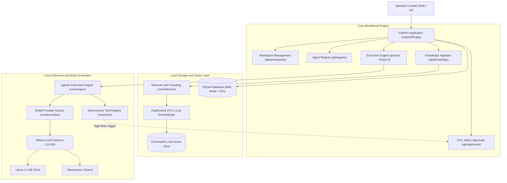

# CogniShift: Sovereign On-Premise Agentic AI Workbench

[](https://www.sih.gov.in/)
[](https://www.mrpl.co.in/)
[](https://www.python.org/)
[](https://fastapi.tiangolo.com/)
[](https://ollama.com/)
[]()

> **SIH 2024 Problem Statement SIH26117**  
> **Organization:** Mangalore Refinery and Petrochemicals Limited (MRPL)  
> **Title:** Sovereign On-Premise Agentic AI Workbench using Open-Weight Multimodal LLMs for Confidential Industrial Work  
> **Theme:** Smart Automation | **Category:** Software  

---

## Executive Overview

**CogniShift** is an industrial-grade, 100% on-premise agentic workbench engineered specifically for high-consequence petrochemical environments. It operates completely **air-gapped (zero external cloud dependencies)** to ensure that proprietary refinery schematics, standard operating procedures (SOPs), and operational telemetry never leave the enterprise perimeter.

### Key Pillars
1. **100% Sovereign (Zero Cloud):** Powered by local open-weight models (`llama3.2:3b` for text and `moondream` for vision) running via Ollama on local hardware. Cloud LLM calls (OpenAI, Gemini, Anthropic) are strictly blocked by architecture.
2. **Domain-Specific RAG:** Page-aware PDF ingestion using `pypdf`, chunked with overlap, embedded locally via CPU-friendly FastEmbed (`BAAI/bge-small-en-v1.5`), and stored in local ChromaDB vector collections.
3. **Deterministic and Safe Tool Execution:** Simulated industrial actions (e.g., pressure telemetry, valve actuation) with **zero arbitrary command execution** (no `subprocess`, no `os.system`).
4. **Human-in-the-Loop (HITL) Safety Guardrails:** Sensitive and service-interrupting actions (like emergency flare venting or pump restarts) automatically pause execution and queue for supervisor approval.
5. **Multi-Tenant Workspace Isolation:** Segregated workspaces, agents, knowledge bases, and audit trails per refinery unit (e.g., Fluid Catalytic Cracking Unit, Crude Distillation Unit).

---

## High-Level Architecture



---

## Quick Start Guide

### 1. Prerequisites
- **Python 3.12+**
- **NVIDIA GPU** (Optional for CPU-only mock development; recommended 4GB+ VRAM for live Ollama inference)
- **Ollama** installed locally from [ollama.com](https://ollama.com) (for live AI generation)

### 2. Installation
Clone the repository and set up a virtual environment:

```bash
git clone https://github.com/sitanshukr08/CogniShift.git
cd CogniShift

# Create and activate virtual environment
python -m venv .venv
.venv\Scripts\activate   # On Windows
# source .venv/bin/activate  # On Linux/macOS

# Install dependencies
pip install -r requirements.txt
```

### 3. Configuration and Database Setup
Copy the sample environment file and run the refinery seed script:

```bash
# Setup environment file
copy .env.example .env    # Windows PowerShell: copy .env.example .env

# Seed the database with MRPL Refinery workspace, agents, and tools
python scripts/seed.py
```

### 4. Running the Workbench Server

```bash
# Start FastAPI with Uvicorn
python -m uvicorn cognishift.app.main:app --host 127.0.0.1 --port 8000 --reload
```

- **Interactive Operator Console:** [http://127.0.0.1:8000](http://127.0.0.1:8000) (auto-redirects to `/static/index.html`)
- **Swagger Interactive API Docs:** [http://127.0.0.1:8000/docs](http://127.0.0.1:8000/docs)
- **System Health Status:** [http://127.0.0.1:8000/api/v1/system/status](http://127.0.0.1:8000/api/v1/system/status)

---

## Automated Testing

CogniShift includes comprehensive automated unit tests covering database integrity, provider isolation, and schema validation:

```bash
pytest -v
```

*All 10 unit tests execute cleanly in ~0.25 seconds without external network access.*

---

## API Reference Overview

| Method | Endpoint | Description | Phase |
|:---|:---|:---|:---:|
| `GET` | `/api/v1/system/status` | System health, DB state, and Ollama connectivity | Phase 1 |
| `GET` | `/api/v1/system/privacy-status` | Verification of air-gapped boundary | Phase 1 |
| `GET` | `/api/v1/workspaces` | List all industrial workspaces | Phase 2 |
| `POST` | `/api/v1/workspaces` | Provision a new segregated workspace | Phase 2 |
| `GET` | `/api/v1/agents` | List agent definitions (filtered by workspace) | Phase 2 |
| `POST` | `/api/v1/agents` | Create a custom industrial agent | Phase 2 |
| `PATCH`| `/api/v1/agents/{id}` | Update agent instructions or tool allowlists | Phase 2 |
| `POST` | `/api/v1/knowledge/upload` | Ingest PDF manual, extract text and embed to ChromaDB | Phase 4 |
| `GET` | `/api/v1/knowledge` | List active documents in workspace | Phase 4 |
| `DELETE`| `/api/v1/knowledge/{id}` | Purge document, physical file, and vector embeddings | Phase 4 |
| `GET` | `/api/v1/approvals` | View pending high-risk tool authorizations | Phase 6 |
| `POST` | `/api/v1/approvals/{id}/approve` | Supervisor authorization to resume execution | Phase 6 |
| `POST` | `/api/v1/approvals/{id}/reject` | Supervisor rejection of risky action | Phase 6 |
| `POST` | `/api/v1/runs` | Trigger agent reasoning and execution loop | **Phase 5 (Next)** |

---

## Security and Enterprise Guarantees

* **Zero Arbitrary Execution:** No dynamic shell code execution (`subprocess.run`, `os.system`, `eval()`).
* **Strict Parameterized Queries:** All SQLite queries utilize bound placeholders (`?`) to prevent SQL injection.
* **Referential Integrity:** SQLite foreign keys are enforced at runtime via `PRAGMA foreign_keys = ON;`.
* **Path Traversal Protection:** All file uploads use sanitized UUID-prefixed basenames stored in scoped directories.

---

## Engineering Team and Delivery Roadmap

| Phase | Component | Assigned Lead | Status |
|:---|:---|:---:|:---:|
| **Phase 1** | Foundation, Config, and Lifespan | Sitanshu & AI | Complete |
| **Phase 2** | SQLite Database and CRUD APIs | Sitanshu & AI | Complete |
| **Phase 3** | Provider Abstraction (Ollama / Sim) | Sitanshu & AI | Complete |
| **Phase 4** | Knowledge Pipeline (PDF RAG + ChromaDB) | Rohit & AI | Complete |
| **Phase 6** | Industrial Tools and HITL Approvals | Rohit & AI | Complete |
| **Phase 5** | AI Execution Engine (`engine.py`, `runs.py`) | Sitanshu & AI | **In Progress** |
| **Phase 7** | Multimodal Vision Integration (Moondream) | Sitanshu & AI | Queued |
| **Phase 8** | Enterprise UI and Full Integration Test | Team Collaboration | Target Sept 6-7 |

---

*For an easy-to-read explanation of every file and an interactive walkthrough, see **[information.md](information.md)**.*
