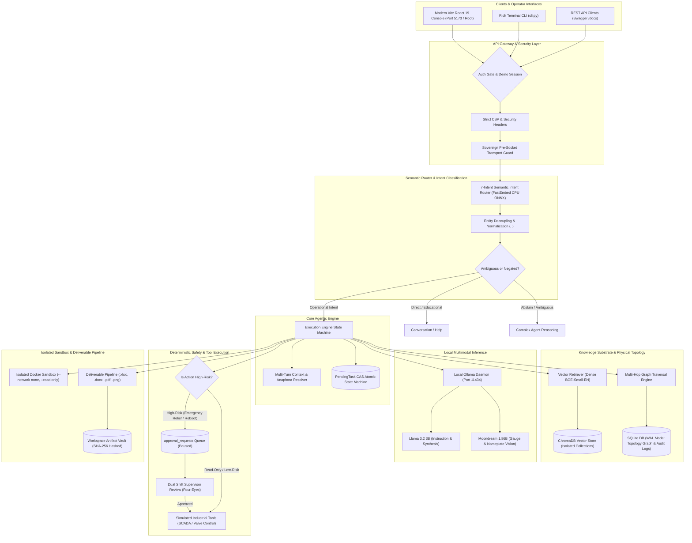

# CogniShift: Sovereign On-Premise Agentic AI Workbench for Industrial Operations

[](https://www.sih.gov.in/)
[](https://www.mrpl.co.in/)
[](https://www.python.org/)
[](https://fastapi.tiangolo.com/)
[](frontend/)
[-purple.svg)](https://ollama.com/)
[-darkred.svg)](https://ollama.com/)
[](https://github.com/qdrant/fastembed)
[-lightgrey.svg)](https://www.trychroma.com/)
[-003B57.svg)](https://sqlite.org/)
[]()
[]()

**CogniShift** is a sovereign, on-premise agentic AI prototype for industrial operations. It executes open-weight language, vision, and embedding models locally. Application-level egress controls and their current backend-verified state are exposed in the UI; a deployment is physically air-gapped only when its network environment has been independently verified.

Engineered for the Smart India Hackathon problem statement **SIH26117** in collaboration with **Mangalore Refinery and Petrochemicals Limited (MRPL)**.

---

## Table of Contents

1. [Why CogniShift Exists](#why-cognishift-exists)
2. [Core Architectural Pillars](#core-architectural-pillars)
3. [End-to-End System Architecture](#end-to-end-system-architecture)
4. [Deep Dive: Core Engine Subsystems](#deep-dive-core-engine-subsystems)
   - [4.1. FastEmbed 7-Intent Semantic Intent Router](#41-fastembed-7-intent-semantic-intent-router)
   - [4.2. Multi-Turn Conversational Continuity & CAS Pending Tasks](#42-multi-turn-conversational-continuity--cas-pending-tasks)
   - [4.3. Industrial Plant Topology Graph Memory](#43-industrial-plant-topology-graph-memory)
   - [4.4. Four-Eyes Principle & Human-in-the-Loop Interlocks](#44-four-eyes-principle--human-in-the-loop-interlocks)
   - [4.5. Multimodal Document Processing, OCR & Gauge Vision](#45-multimodal-document-processing-ocr--gauge-vision)
   - [4.6. Multi-Format Deliverable Generation Pipeline](#46-multi-format-deliverable-generation-pipeline)
   - [4.7. Air-Gapped Code Execution Sandbox (Docker)](#47-air-gapped-code-execution-sandbox-docker)
   - [4.8. Multi-Tenant Workspace Isolation](#48-multi-tenant-workspace-isolation)
5. [The Operator Console (Vite + React 19 + TypeScript)](#the-operator-console-vite--react-19--typescript)
6. [Network Sovereignty & Air-Gap Defense-in-Depth](#network-sovereignty--air-gap-defense-in-depth)
7. [REST API Reference](#rest-api-reference)
8. [Installation & Getting Started](#installation--getting-started)
9. [Terminal CLI Workbench](#terminal-cli-workbench)
10. [Automated Verification & Test Suite](#automated-verification--test-suite)
11. [Project Directory Structure](#project-directory-structure)
12. [Hardware Requirements & Telemetry](#hardware-requirements--telemetry)
13. [Industrial Demonstration Scenarios](#industrial-demonstration-scenarios)
14. [Security Model & Purdue Hierarchy Compliance](#security-model--purdue-hierarchy-compliance)

---

## Why CogniShift Exists

Refineries and critical processing plants operate under stringent safety regulations (OSHA 1910.119 Process Safety Management, OISD standards, IEC 62443). Their operational documentation—Piping & Instrumentation Diagrams (P&IDs), operating envelopes, emergency response procedures, and SCADA stream registers—contains confidential industrial trade secrets and high-security national infrastructure details.

Traditional cloud-hosted LLM services (OpenAI, Anthropic, Gemini) introduce critical operational and cybersecurity risks:
* **Confidentiality Breach:** Sensitive process parameters and proprietary piping layouts egress to third-party cloud servers.
* **Loss of Availability:** Cloud service outages or WAN disconnection sever access during plant emergencies.
* **Hallucination in Operations:** Unconstrained LLMs cannot be trusted with actuator control or equipment trips without deterministic safety gates.

**CogniShift solves this by bringing agentic intelligence directly onto plant-floor edge hardware.** Every token, embedding vector, image tensor, and database row remains strictly on-premise.

---

## Core Architectural Pillars

* **Local-first & Sovereign:** Local model and embedding runtimes are used. Application-level outbound controls are enforced and audited; physical isolation depends on deployment configuration and verification.
* **Deterministic Safety Interlocks:** Dangerous physical control actions (emergency relief, pump reboots) cannot be triggered directly by LLMs; they halt the execution state machine until independent supervisors sign off.
* **Hybrid Knowledge Substrate:** Combines dense semantic vector retrieval over technical SOPs with structural graph traversal over physical plant topology (equipment piping, instrumentation, relief valves).
* **Audited Multi-Turn State Machine:** Compare-And-Swap (CAS) atomic task resumption, safe cancellations, 15-minute TTL expiration, and cross-turn pronoun resolution.
* **Verifiable Deliverable Synthesis:** Generates formal Excel spreadsheets, Word memos, publication-grade PDF audits, and high-resolution telemetry charts with SHA-256 integrity verification.

---

## End-to-End System Architecture



---

## Deep Dive: Core Engine Subsystems

### 4.1. FastEmbed 7-Intent Semantic Intent Router
Traditional agent platforms funnel every user prompt into a multi-thousand-token prompt sent to an LLM, causing latency spikes and severe false-positive execution risks. CogniShift implements a CPU-accelerated, zero-cloud semantic routing classifier based on FastEmbed (`BAAI/bge-small-en-v1.5`):

```
                                  [ User Query ]
                                         │
                         ┌───────────────┴───────────────┐
                         ▼                               ▼
                 [ Entity Detection ]          [ Regex / Rule Guards ]
               • Files: payroll.csv          • Negations: "Do not restart..."
               • Equipment: P-101A, K-203    • Navigation: "open sandbox"
                         │                               │
                         └───────────────┬───────────────┘
                                         ▼
                 [ Normalization: Token Decoupling ]
                 "Restart P-101A" ──► "Restart <equipment_id>"
                                         │
                                         ▼
                 [ FastEmbed 384-d Cosine Vector Classifier ]
                                         │
      ┌─────────────┬─────────────┬──────┴──────┬─────────────┬─────────────┐
      ▼             ▼             ▼             ▼             ▼             ▼
CONVERSATION   KNOWLEDGE     ARTIFACT        CODE          CONTROL       COMPLEX
  • Help       • SOP query   • Excel audit   • Sandbox     • Valve trip  • Multi-step
  • Dialect    • Tolerances  • Memo review   • Plot chart  • Sensor poll   diagnostic
```

* **The 7 Discrete Semantic Intents:**
  1. `CONVERSATION`: System capability inquiries (*"what tools do you have?"*), greetings, and conversational follow-ups.
  2. `KNOWLEDGE_QUERY`: Plant manual lookups, API/OISD standards (*"what is normal suction pressure for P-101A?"*).
  3. `ARTIFACT_INSPECTION`: Inspection of generated deliverables (*"what is in MRPL_Audit.xlsx?"*).
  4. `CODE_EXECUTION`: Explicit data-science calculations, spreadsheet analysis, and plotting.
  5. `CONTROL_ACTION`: Actuating valves, reading SCADA registers, triggering trips.
  6. `UI_NAVIGATION`: Seamless client routing (*"take me to approvals view"*).
  7. `COMPLEX_AGENT`: Multi-turn root-cause diagnostic workflows requiring iterative synthesis.
* **Cross-Equipment Invariance:** Equipment tags (`P-101A`, `K-203`, `VALVE-12`) and filenames are dynamically normalized into `<equipment_id>` and `<file>` tokens before vector embedding. This prevents the classifier from misrouting unfamiliar equipment.
* **Zero False-Positive Safety Guarantee:** Educational questions (*"How do you restart a pump?"*) or ambiguous modal directives (*"Can you trigger pressure relief?"*) are safely intercepted by deterministic rule guards and routed to `CONVERSATION` or `COMPLEX_AGENT`, completely eliminating unauthorized direct control execution.

---

### 4.2. Multi-Turn Conversational Continuity & CAS Pending Tasks
Industrial operations are fundamentally conversational and iterative. When an agent proposes a high-consequence action, the operator may ask clarifying questions before authorizing execution:

```
Turn 1: Operator: "Analyze discharge pressure on P-101A."
        Agent:    "Pressure is 485 PSI (exceeds 450 PSI limit). I recommend emergency depressurization."
                  [State: PAUSED | PendingTask #412 queued]

Turn 2: Operator: "What happens if we depressurize now?"
        Agent:    "Relief valve SV-402 will route vapors to flare header. Reactor-B remains isolated."
                  [State: PENDING maintained | TTL reset]

Turn 3: Operator: "Yes, go ahead and do it."
        Agent:    [CAS atomic lock claimed] "Affirmation confirmed. Executing emergency depressurization."
                  [State: RESUMED ──► COMPLETED]
```

* **Atomic Compare-And-Swap (CAS):** Prevents race conditions and double execution:
  ```sql
  UPDATE pending_tasks
  SET status = 'CLAIMED', claimed_at = ?
  WHERE id = ? AND status = 'PENDING';
  ```
* **Affirmation Recognition:** Robust affirmation resolution recognizes natural confirmations (*"yes do it"*, *"proceed"*, *"confirmed"*, *"approve"*) and resumes the pending execution state machine.
* **Safe Cancellation:** Operators can abort pending proposals (*"cancel that"*, *"stop"*, *"abort"*) without triggering side effects.
* **15-Minute TTL Expiration:** Pending tasks expire automatically after 15 minutes to prevent stale operations from executing accidentally during shift changes.
* **Anaphora Resolution:** Resolves pronouns (*"it"*, *"that pump"*, *"the document"*) against the conversation's active entity history.

---

### 4.3. Industrial Plant Topology Graph Memory
Dense vector search alone cannot determine physical plant connectivity. CogniShift couples ChromaDB with an explicit relational Knowledge Graph in SQLite (`graph_nodes` and `graph_edges`):

```
  [ Sensor: PT-101 ] ──MONITORS──► [ Pump: P-101A ] ──FEEDS_INTO──► [ Reactor: Reactor-B ]
                                                                            │
                                                                       PROTECTED_BY
                                                                            │
                                                                            ▼
  [ Flare Header ] ◄──DISCHARGES_TO── [ Valve: SV-402 (Set: 450 PSI) ] ◄────┘
```

* **Multi-Hop Traversal:** When diagnosing an alarm on `PT-101`, the engine executes recursive SQL queries to uncover upstream feeds, downstream reactors, and protective relief valves.
* **Context Injection:** Topological neighbors and design limits are automatically formatted and injected into the model context before reasoning begins.

---

### 4.4. Four-Eyes Principle & Human-in-the-Loop Interlocks
To prevent catastrophic industrial failures, CogniShift enforces strict dual-authorization gates for high-consequence tools:

| Tool Name | Risk Level | Execution Mode | Required Approvals |
|:---|:---:|:---:|:---:|
| `check_pressure` | `read_only` | Autonomous | 0 (Auto-executes) |
| `check_temperature` | `read_only` | Autonomous | 0 (Auto-executes) |
| `check_network` | `read_only` | Autonomous | 0 (Auto-executes) |
| `run_diagnostic` | `low_risk` | Autonomous | 0 (Auto-executes) |
| `execute_code` (sandbox) | `sensitive` | Autonomous / Supervised | Governed by agent policy |
| `restart_component` | `sensitive` | **Four-Eyes Interlock** | **2 Independent Supervisors** |
| `emergency_pressure_relief` | `service_interrupting` | **Four-Eyes Interlock** | **2 Independent Supervisors** |
| `restart_service` | `service_interrupting` | **Four-Eyes Interlock** | **2 Independent Supervisors** |

* **Dual Independent Reviewers:** High-risk actions require independent sign-offs (`reviewed_by` and `reviewed_by_2`). The second reviewer cannot be the same user as the first.
* **Authoritative Crash Recovery:** Approval state is persisted in SQLite (`approval_requests` table). If the server restarts mid-approval, the request remains intact and resumes cleanly upon approval.

---

### 4.5. Multimodal Document Processing, OCR & Gauge Vision

```
                                [ Incoming File / Photo ]
                                            │
                        ┌───────────────────┼───────────────────┐
                        ▼                   ▼                   ▼
                 [ Vector PDF ]      [ Scanned PDF / Image ] [ Equipment Photo ]
                        │                   │                   │
                     pypdf              RapidOCR            Moondream VLM
                 Digital Text         CPU/GPU OCR         Gauge Angle & Dial
                        │                   │                   │
                        └───────────────────┼───────────────────┘
                                            ▼
                               [ Provenance & Escaping ]
                        <document_context name="..." page="...">
                        (Delimiter-escaped text safely injected)
```

1. **Digital PDF Text Stream (`pypdf`):** Losslessly extracts text, metadata, and page numbers from electronic manuals.
2. **Local OCR Engine (`RapidOCR`):** Extracts printed characters and tag bubbles from scanned technical drawings using local ONNX weights on CPU/GPU.
3. **Local Gauge Vision Model (`moondream:latest`):** Analyzes analog Bourdon dials, digital panel meters, and stamped rating plates, extracting needle angles, scale units (PSI/bar), and serial tags.
4. **Untrusted Data Provenance:** All retrieved context is escaped and enclosed within `<document_context ...>` tags, preventing indirect prompt injection from malicious document text.

---

### 4.6. Multi-Format Deliverable Generation Pipeline
CogniShift synthesizes professional, publication-ready engineering deliverables locally:

* **Spreadsheets (`.xlsx` via `openpyxl`):** Multi-sheet financial and operational workbooks with formatted headers, custom column widths, formula calculations, and conditional status formatting.
* **Engineering Memos (`.docx` via `python-docx`):** Formal corporate documents with executive summaries, telemetry tables, and sign-off blocks.
* **Vector Documents (`.pdf` via `reportlab`):** Industrial audit reports with precise margins, typography, running footers, and page numbers.
* **Visualizations (`.png` via `matplotlib` & `seaborn`):** Publication-quality trend charts, multi-panel sensor comparisons, and alarm distribution plots.
* **Cryptographic Tamper Verification:** Every artifact is hashed (SHA-256) upon generation. File downloads verify the hash on disk against the database ledger, rejecting altered files with HTTP 409 Conflict.
* **Quarantine:** Stored strictly within per-workspace subdirectories (`data/workspaces/{id}/generated/`).

---

### 4.7. Air-Gapped Code Execution Sandbox (Docker)
When calculations or data transformations require Python execution, the agent delegates to an isolated container:

```bash
docker run --rm \
  --network none \
  --read-only \
  --memory 512m \
  --pids-limit 64 \
  --user 10001:10001 \
  --volume <scratch_dir>:/workspace:rw \
  cognishift/sandbox-python:3.12-v1 python /workspace/main.py
```

* **Network Disabled:** `--network none` guarantees zero data exfiltration during execution.
* **Filesystem Immutability:** The container root filesystem is read-only; execution can only write to a bounded, temporary scratch volume.
* **Self-Debug Retry Loop:** If code fails with a syntax or runtime error, the engine captures stdout/stderr and feeds the trace back into the model for bounded, self-correcting repair loops.

---

### 4.8. Multi-Tenant Workspace Isolation
Industrial environments segregate units (e.g., Crude Distillation Unit vs. Fluidized Catalytic Cracker). CogniShift strictly partitions resources:
* **Relational Database:** Foreign-key constraints enforce workspace isolation across agents, runs, tools, documents, and approval requests.
* **ChromaDB Collections:** Each workspace maintains its own isolated vector collection (`workspace_{id}`).
* **Filesystem Isolation:** Ingested files, document caches, and generated deliverables reside in dedicated workspace subtrees.
* **Approval Queue Isolation:** Shift supervisors only see approval requests belonging to their active workspace.

---

## The Operator Console (Vite + React 19 + TypeScript)

The CogniShift web interface is a modern Single Page Application located in `frontend/`:

```
frontend/src/
├── App.tsx                     # Top-level React Router & AuthGate wrapper
├── api/                        # Strongly-typed sovereign REST clients
├── auth/                       # Bearer credentials & demo persona state
├── context/                    # Multi-tenant workspace context provider
├── components/                 # Shared industrial UI components
│   ├── AppShell.tsx            # Global navigation rail & status dock
│   ├── ApprovalCard.tsx        # Four-Eyes dual supervisor approval card
│   ├── EventTimeline.tsx       # Live reasoning step-by-step trace
│   ├── StatusBeacon.tsx        # Air-gap status, model telemetry, loopback beacon
│   └── WorkspacePicker.tsx     # Active workspace selector
└── pages/                      # Primary view routes
    ├── DashboardPage.tsx       # Plant overview & live telemetry summary
    ├── OperatorPage.tsx        # Interactive execution console & quick scenarios
    ├── WorkspacesPage.tsx      # Multi-tenant workspace management
    ├── AgentsPage.tsx          # Agent configuration, tools & system prompts
    ├── KnowledgePage.tsx       # Document ingestion & vector status
    ├── RunsPage.tsx            # Execution history & timeline logs
    ├── ApprovalsPage.tsx       # Four-Eyes supervisor authorization queue
    ├── ArtifactsPage.tsx       # Deliverable preview & SHA-256 download
    └── SystemPage.tsx          # Hardware telemetry, VRAM & air-gap status
```

### Key UI Features:
* **Zero External CDNs:** Handcrafted SVG icon library (`Icon.tsx`), local Tailwind CSS design system, and bundled fonts.
* **Quick Scenario Dispatcher:** Pre-configured operational templates (`check-pt101-telemetry`, `trip-495psi-emergency`, `verify-tt204-temp`) for zero-typing demonstration.
* **Live Step-by-Step Reasoning:** Real-time event timeline visualizing model thoughts, tool invocations, observations, and safety gates.
* **Dual-Serving Architecture:** Run with Vite HMR (`npm run dev` at `localhost:5173`) during development, or compile to static distribution (`npm run build` to `frontend/dist`) served directly by the FastAPI backend at `http://127.0.0.1:8000/`.

---

## Network Sovereignty & Air-Gap Defense-in-Depth

CogniShift applies defense-in-depth across three architectural layers:

```
[ LAYER 1: Application Pre-Socket Guard ]
  • SovereignAsyncTransport intercepts all HTTP requests before TCP handshake.
  • Enforces loopback-only destinations (127.0.0.1, ::1 on ports 8000, 11434).
  • All external domains, public IPs, and RFC 1918 LANs are rejected instantly.

[ LAYER 2: Operating System Kernel Firewall ]
  • Process-scoped Windows Defender Firewall rules bind python.exe.
  • Outbound traffic to WAN/LAN is blocked at the kernel network stack.
  • Configured via scripts/enable_strict_network_policy.ps1.

[ LAYER 3: Independent Host-Level Observer ]
  • scripts/observe_network.py polls the OS socket table via psutil.
  • Verified by negative-control socket detection probes.
  • Proves zero unauthorized external sockets during live operation.
```

### Content Security Policy (CSP):
All HTTP responses carry hardened security headers:
```http
Content-Security-Policy: default-src 'self'; script-src 'self'; style-src 'self' 'unsafe-inline'; img-src 'self' data:; font-src 'self'; connect-src 'self'; frame-ancestors 'none';
X-Content-Type-Options: nosniff
X-Frame-Options: DENY
Referrer-Policy: no-referrer
```

---

## REST API Reference

All API routes are served under `/api/v1/` and documented interactively at `/docs`:

| Method | Endpoint | Description | Auth Required |
|:---|:---|:---|:---:|
| `GET` | `/api/v1/workspaces` | List all available workspaces | Yes |
| `POST` | `/api/v1/workspaces` | Create a new isolated workspace | Yes |
| `GET` | `/api/v1/agents` | List agents in a workspace | Yes |
| `POST` | `/api/v1/agents` | Register a new agent with tool policies | Yes |
| `POST` | `/api/v1/knowledge/upload` | Ingest and embed a document into ChromaDB | Yes |
| `GET` | `/api/v1/knowledge` | List ingested knowledge sources | Yes |
| `POST` | `/api/v1/runs` | Execute an agent run (text prompt + image) | Yes |
| `GET` | `/api/v1/runs/{id}` | Inspect run status, plan, and synthesis | Yes |
| `GET` | `/api/v1/runs/{id}/events` | Stream step-by-step reasoning events | Yes |
| `GET` | `/api/v1/approvals` | List pending Four-Eyes supervisor requests | Yes |
| `POST` | `/api/v1/approvals/{id}/approve` | Sign off on a pending operational action | Yes |
| `POST` | `/api/v1/approvals/{id}/reject` | Reject a pending operational action | Yes |
| `GET` | `/api/v1/artifacts` | List generated deliverables for a workspace | Yes |
| `GET` | `/api/v1/artifacts/{id}/download` | Download deliverable with SHA-256 check | Yes |
| `GET` | `/api/v1/system/health` | System diagnostics & loopback status | Yes |
| `GET` | `/api/v1/system/telemetry` | GPU VRAM, Ollama models, and memory stats | Yes |

---

## Installation & Getting Started

### Prerequisites
* **Python 3.12**
* **Node.js 18+ & npm**
* **Ollama** (`http://localhost:11434`)
* **Docker Desktop** (for containerized code execution)
* Recommended: Local NVIDIA GPU with 6GB+ VRAM (e.g. RTX 3050 Laptop GPU or higher)

### 1. Clone & Configure Python Environment
```bash
git clone https://github.com/sitanshukr08/CogniShift.git
cd CogniShift

python -m venv .venv
.venv\Scripts\activate      # Windows PowerShell
# source .venv/bin/activate # Linux / macOS

pip install -r requirements.txt
```

### 2. Pull Local Models via Ollama
```bash
ollama pull llama3.2:3b
ollama pull moondream
```

### 3. Install & Build Operator Console
```bash
cd frontend
npm install
npm run build              # Builds compiled SPA to frontend/dist
cd ..
```

### 4. Initialize Database & Seed Plant Topology
```bash
python scripts/seed.py
```

### 5. Verify Offline Preflight Readiness
```bash
python scripts/check_offline_demo_readiness.py
```

### 6. Launch the Workbench
```powershell
# Enable loopback demo personas for SIH rehearsal (optional):
$env:COGNISHIFT_DEMO_MODE='true'

# Start the sovereign backend:
python -m uvicorn cognishift.app.main:app --host 127.0.0.1 --port 8000 --reload
```

* **Production Console:** Navigate to [http://127.0.0.1:8000/](http://127.0.0.1:8000/) in your browser.
* **Vite Live Dev Console (Alternative):** Run `npm --prefix frontend run dev` and open [http://localhost:5173](http://localhost:5173).
* **Swagger API Docs:** [http://127.0.0.1:8000/docs](http://127.0.0.1:8000/docs).

---

## Terminal CLI Workbench

For air-gapped industrial consoles or edge terminals without a browser:

```bash
# Interactive conversational operator shell
python cli.py chat

# Inspect system status and model readiness
python cli.py status

# Perform vector search over ingested plant manuals
python cli.py knowledge search "discharge pressure limits for P-101A"

# Execute multimodal run with attached gauge photo
python cli.py run execute "Inspect gauge dial" --image "data/vision_test/gauge_pressure_nominal_105psi.png"

# Manage supervisor approvals
python cli.py approvals list
python cli.py approvals approve <approval_id>
```

---

## Automated Verification & Test Suite

CogniShift includes an exhaustive test suite covering unit, integration, and security boundaries:

```bash
pytest -v
```

Test counts change as the product evolves. Run the command above on the intended
release commit and report its exact output, including failures and environmental
skips; do not treat historical counts as current release evidence.

### Targeted Test Suites:
```bash
# Semantic router & generalization invariance
pytest tests/test_semantic_router.py tests/test_semantic_router_generalization.py -v

# Multi-turn conversational engine & CAS pending tasks
pytest tests/test_pending_tasks_and_continuation.py tests/test_conversational_protocol.py -v

# Isolated Docker sandbox & code retry loops
pytest tests/test_phase4_sandbox.py tests/test_sandbox_deep.py -v

# Network sovereignty & browser egress tests
pytest tests/test_phase6_browser_egress.py -v

# Workspace multi-tenant isolation
pytest tests/test_workspace_isolation.py -v

# Deliverable generation pipeline (.xlsx, .docx, .pdf, .png)
pytest tests/test_phase3_artifacts.py -v
```

---

## Project Directory Structure

```
CogniShift/
├── cli.py                                  # Terminal CLI entry point
├── pytest.ini                              # Pytest configuration
├── requirements.txt                        # Python backend dependencies
├── ARCHITECTURE.md                         # Systems architecture specification
├── README.md                               # Project documentation
├── docker/
│   └── Dockerfile                          # Hardened Python 3.12 sandbox container
├── frontend/                               # React 19 + TypeScript + Vite Console
│   ├── package.json                        # Frontend packages and scripts
│   ├── vite.config.ts                      # Vite build & reverse proxy configuration
│   ├── index.html                          # Zero-CDN SPA HTML template
│   └── src/
│       ├── App.tsx                         # Client router and AuthGate
│       ├── api/                            # Sovereign REST client wrappers
│       ├── auth/                           # Authentication and demo personas
│       ├── components/                     # Shared UI primitives and widgets
│       └── pages/                          # Primary view routes
├── scripts/
│   ├── seed.py                             # Relational DB & topology seed script
│   ├── check_offline_demo_readiness.py     # 12-point air-gap preflight verifier
│   └── observe_network.py                  # Host-level socket monitoring daemon
├── src/
│   └── cognishift/
│       ├── app/
│       │   ├── main.py                     # FastAPI application setup & SPA serving
│       │   ├── config.py                   # Settings & environment configuration
│       │   ├── api/                        # REST route endpoints
│       │   │   ├── workspaces.py           # Workspace CRUD
│       │   │   ├── agents.py               # Agent registration & tool binding
│       │   │   ├── knowledge.py            # Document ingestion & search
│       │   │   ├── runs.py                 # Agent run dispatch & events
│       │   │   ├── approvals.py            # Four-Eyes supervisor approvals
│       │   │   ├── artifacts.py            # Deliverable preview & download
│       │   │   └── system.py               # Telemetry & health diagnostics
│       │   └── db/
│       │       ├── database.py             # aiosqlite connection pool (WAL mode)
│       │       └── models.py               # Pydantic v2 schemas
│       └── core/
│           ├── engine.py                   # Agentic reasoning engine & safety gates
│           ├── semantic_router.py          # FastEmbed 7-intent classification router
│           ├── pending_tasks.py            # CAS atomic state machine & TTL manager
│           ├── conversation_context.py     # Multi-turn context & anaphora resolver
│           ├── artifact_generators.py      # Deliverable pipeline (.xlsx, .docx, .pdf, .png)
│           ├── retriever.py                # ChromaDB vector retrieval & citation formatter
│           ├── graph_memory.py             # SQLite equipment topology traversal
│           ├── tools.py                    # Simulated industrial tool implementations
│           ├── tool_schemas.py             # Authoritative tool schemas & risk levels
│           ├── model_router.py             # Task-to-model allocation logic
│           ├── providers.py                # ModelProvider base class & factory
│           ├── ollama_provider.py          # Ollama local HTTP provider
│           ├── simulated_provider.py       # Deterministic mock provider for tests
│           ├── sandbox/                    # Docker containerized execution engine
│           ├── network/                    # Pre-socket transport guard & network policy
│           └── document_processing/        # Multimodal OCR & vision service
└── tests/                                  # 401+ automated tests (100% passing)
```

---

## Hardware Requirements & Telemetry

| Workstation Tier | Recommended Hardware | Models Hosted | Performance |
|:---|:---|:---|:---:|
| **Edge Laptop (Test Bed)** | Intel i5/i7 (12th Gen+) + NVIDIA RTX 3050 (6GB VRAM) | `llama3.2:3b` + `moondream:latest` | ~28 tok/s text, ~1.2s gauge vision |
| **Plant Edge Server** | Intel Xeon / AMD Ryzen 9 + NVIDIA RTX 4080 (16GB VRAM) | `llama3.2:3b` / `qwen2.5:7b` + `moondream` | ~65 tok/s text, ~0.6s gauge vision |
| **CPU-Only Air-Gap Node** | 16-core CPU + 32GB RAM | `bge-small-en` (CPU) + `RapidOCR` + LLM via CPU | Supported via CPU quantization |

* **VRAM Allocation:** `llama3.2:3b` consumes ~2.0 GB VRAM; `moondream:latest` consumes ~1.7 GB VRAM. Both fit comfortably inside 6GB consumer laptop GPUs with VRAM headroom for OS display buffers.
* **CPU Vector Overhead:** FastEmbed utilizes ~130 MB RAM on CPU with zero GPU VRAM consumption.

---

## Industrial Demonstration Scenarios

### Scenario 1: Multimodal Gauge Reading & Anomaly Detection
An operator uploads an analog pressure gauge photo (`data/vision_test/gauge_pressure_nominal_105psi.png`). The Moondream vision model reads the needle angle, calculates dial calibration, and extracts 105 PSI. The engine references the P&ID topology for `P-101A`, retrieves normal operating bounds (90–120 PSI), and logs nominal status without operator interruption.

### Scenario 2: Emergency Depressurization with Four-Eyes Interlock
During a surge simulation, `PT-101` reports 495 PSI (critical threshold: 450 PSI). The agent identifies emergency depressurization via `emergency_pressure_relief`. The safety gate pauses execution and routes a request to `approval_requests`. Supervisor 1 (`jane_supervisor`) approves; the system holds until Supervisor 2 (`rohit_lead`) signs off. Only upon dual sign-off does the valve actuate.

### Scenario 3: 3-Year Financial & Operational Audit Report
An operator requests: *"Generate a 3-year financial audit report comparing operational expenses across MRPL refinery units."* The engine executes data extraction scripts inside the Docker sandbox, generates a multi-sheet styled `.xlsx` workbook, a formal `.docx` executive memo, and a publication-grade `.pdf` report with embedded `.png` trend charts, saving them with SHA-256 tamper verification into the workspace vault.

---

## Security Model & Purdue Hierarchy Compliance

CogniShift maps to **Purdue Model Level 3/3.5 (Industrial DMZ / Operations Management)**:

* **Level 0/1 (Physical Field Devices):** Sensors, pumps, and valves. CogniShift interfaces with Level 1 actuators exclusively through validated, simulated software tool bridges.
* **Level 2 (Control Systems & SCADA):** SCADA servers and DCS controllers. Telemetry streams are queried locally.
* **Level 3 (Operations Management):** CogniShift runs at this layer, providing decision support, document RAG, and audit tracking.
* **Level 3.5 (Industrial DMZ):** Strict network policies isolate CogniShift from corporate Level 4 enterprise networks and Level 5 cloud systems.

---

## License

Developed under the Smart India Hackathon 2024 / 2026 Initiative (SIH26117).  
Proprietary to Mangalore Refinery and Petrochemicals Limited (MRPL) and Team Den of Devs. All rights reserved.
