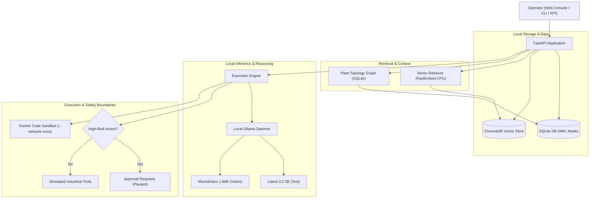

# CogniShift: Local Agentic AI Workbench for Industrial Operations

[](https://www.sih.gov.in/)
[](https://www.mrpl.co.in/)
[](https://www.python.org/)
[](https://fastapi.tiangolo.com/)
[](frontend/)
[](https://ollama.com/)
[-brightgreen.svg)]()

CogniShift is a sovereign, self-hosted agentic AI workbench engineered for safety-critical industrial operations (Purdue Level 3/3.5). It runs open-weight language, vision, and embedding models on local air-gapped hardware without requiring external cloud APIs or leaking telemetry.

Developed for Smart India Hackathon problem statement **SIH26117** (Mangalore Refinery and Petrochemicals Limited - MRPL).

---

## What CogniShift Does

* **Answers operational questions** using local documentation, standard operating procedures, and equipment manuals.
* **Classifies user intent** via an offline 7-intent Semantic Intent Router powered by CPU FastEmbed with entity normalization and safe abstention.
* **Cites exact source locations** with page-level references (`[Filename | Page X]`).
* **Understands physical connections** between plant equipment using a local topology graph (SQLite Graph memory).
* **Inspects photos and diagrams** using a local vision model (`moondream:latest`) to read analog dials, Bourdon gauges, and equipment nameplates.
* **Enforces Four-Eyes supervisor review** for sensitive or high-risk actions through dual independent authorization gates (`reviewed_by` + `reviewed_by_2`).
* **Manages multi-turn conversations** with atomic Compare-And-Swap (CAS) pending tasks, affirmation resumption (*"yes do it"*), and 15-minute TTL expiration.
* **Generates professional engineering deliverables** across spreadsheets (`.xlsx`), reports (`.docx`, `.pdf`), charts (`.png`), and structured datasets (`.json`) with SHA-256 tamper verification.
* **Executes generated code safely** inside an isolated Docker container with zero network access (`--network none`) and read-only filesystem boundaries.

---

## Why It Exists

Industrial plants and refineries maintain sensitive operational procedures, piping schematics, and equipment logs that cannot be uploaded to third-party cloud services due to confidentiality and infrastructure security policies.

CogniShift addresses this by keeping all data storage, vector indexing, and model inference on local premises.

---

## How It Works



---

## Model Routing & Local Inference

CogniShift connects to local models running via [Ollama](https://ollama.com):
* **Text & Reasoning:** `llama3.2:3b` handles instruction following, RAG synthesis, and tool call selection.
* **Vision & Dial Reading:** `moondream:latest` (1.86B parameter VLM) interprets equipment images and analog gauge dials.
* **Local Embeddings:** `fastembed` (`BAAI/bge-small-en-v1.5`) runs on CPU to generate 384-dimensional dense vectors without consuming GPU memory.
* **Simulated Provider:** A mock provider is included for automated testing without requiring an active GPU.

---

## Agent & Deterministic Safety Interlocks

The agent operates in a bounded step-by-step execution loop:
1. Gathers context from vector retrieval, equipment topology, and any attached images.
2. Formulates a structured response or proposes tool actions.
3. **Safety Gate:** Tool risk levels (`read_only`, `low_risk`, `sensitive`, `service_interrupting`) are checked by deterministic infrastructure code, not by the model itself.
4. If an action requires approval, the run transitions to `paused` and queues an entry in `approval_requests`.
5. A supervisor reviews the request through the Web Console, Terminal CLI, or REST API. Once approved, the run resumes.

---

## Safe Code Execution (Docker Sandbox)

When an agent needs to execute Python code (such as calculation scripts), code is not run directly on the host machine:
* Code runs inside an isolated Docker container.
* Network access is disabled: `--network none`.
* Filesystem protections: root filesystem is `--read-only`, with a temporary bounded scratch volume for output.
* Resource limits: memory ceiling (`--memory 512m`), process limits (`--pids-limit 64`), and non-root execution.

---

## Document, OCR & Vision Processing

CogniShift distinguishes between three document processing methods:

| Method | Component | Purpose | Notes |
|:---|:---|:---|:---|
| **Native PDF Extraction** | `pypdf` | Extracts embedded digital text directly from PDF pages | Fast and lossless for digital PDFs |
| **Local OCR** | `RapidOCR` | Reads text from scanned pages and document images | Runs locally on CPU; handwriting is best-effort |
| **Local Vision Model** | `moondream` via Ollama | Interprets visual features in photos (gauge dials, nameplates) | Runs on local GPU |

All retrieved document text is passed through an untrusted data wrapper (`<document_context ...>`) with delimiter escaping. Authorization, permissions, and tool execution boundaries are enforced outside the model context.

---

## Current Project Status

| Phase | Milestone | Status |
|:---:|:---|:---:|
| **Phase 0** | Base Security & Test Harness | Complete |
| **Phase 1** | Foundation, Config & Local Lifespan | Complete |
| **Phase 2** | Database Layer (Async SQLite WAL, 10 tables) & CRUD Routers | Complete |
| **Phase 3** | Model Provider Abstraction & Local Ollama Integration | Complete |
| **Phase 4** | Knowledge Pipeline (ChromaDB) & Docker Code Sandbox | Complete (Verified in live Docker container) |
| **Phase 5** | Multimodal Document Processing (Native PDF, RapidOCR, Moondream Vision) | Complete and verified |
| **Phase 6** | Network Sovereignty Enforcement & Egress Observation | Complete and verified |
| **Phase 7** | Flagship Industrial Demonstration Workflows | Implemented and automated; operator acceptance remains |
| **Auth remediation** | Local demo personas, live credential refresh, secure manual bearer login | Complete and verified |

---

## Network Sovereignty & Egress Observation (Phase 6)

CogniShift enforces strict network boundaries to prevent accidental or malicious data exfiltration:
* **Strict Network Policy:** Operates in `NetworkPolicyMode.STRICT`. Only loopback communication to explicitly approved services (`127.0.0.1:11434`, `::1:11434` for Ollama; `127.0.0.1:8000`, `::1:8000` for FastAPI) is permitted.
* **Pre-Socket Transport Guard:** Outbound HTTP calls pass through `SovereignAsyncTransport` and `SovereignTransport`. Public IP destinations, link-local addresses (`169.254.0.0/16`, `fe80::/10`), and unlisted RFC 1918 private networks are intercepted and blocked prior to establishing TCP handshakes.
* **DNS & Redirect Interception:** Hostnames are resolved pre-connection. If any resolved IP is public or unapproved, the request fails closed. HTTP redirects (`301`, `302`, `307`, `308`) are intercepted with destinations re-evaluated against the policy.
* **Offline Vector Cache:** FastEmbed embeddings operate 100% offline (`local_files_only=True`) using local model cache (`data/models/fastembed`). If assets are missing, the system fails closed without attempting online downloads.
* **CDN-Free Frontend & Strict CSP:** The web dashboard (`frontend/`) contains zero external CDN dependencies (built with local React 19, Tailwind CSS, and system typography). All HTTP responses carry strict Content Security Policy (`default-src 'self'`, `frame-ancestors 'none'`, `connect-src 'self'`).
* **Persistent Network Audit Ledger:** All network attempts are logged to the `network_events` SQLite table with metadata only (no prompt text, authorization headers, or response payloads are stored).
* **Independent Host-Level Observer:** Sockets are monitored at the OS level via `scripts/observe_network.py` with an executable negative control to prove detection accuracy.
* **Operator Firewall Scripts:** PowerShell scripts (`scripts/enable_strict_network_policy.ps1` and `scripts/disable_strict_network_policy.ps1`) configure process-scoped Windows Defender Firewall rules targeting the Python runtime.

---

## Installation & Setup

### 1. Prerequisites
* **Python 3.12**
* **Node.js 18+ & npm** (required for the Vite + React 19 Operator Console)
* **Ollama** installed and running locally (`http://localhost:11434`)
* **Docker Desktop** (required for the containerized code execution sandbox)
* Recommended: Local NVIDIA GPU (tested on NVIDIA GeForce RTX 3050 Laptop GPU, 6GB VRAM)

Pull the local models:
```bash
ollama pull llama3.2:3b
ollama pull moondream
```

### 2. Install Backend & Frontend Dependencies
```bash
git clone https://github.com/sitanshukr08/CogniShift.git
cd CogniShift

# Setup Python environment
python -m venv .venv
.venv\Scripts\activate    # Windows
# source .venv/bin/activate # Linux / macOS

pip install -r requirements.txt

# Setup React Operator Console
cd frontend
npm install
cd ..
```

### 3. Initialize & Seed Database
```bash
python scripts/seed.py
```
Creates local tables and seeds simulated refinery workspaces, agents, tool definitions, and plant equipment topology.

---

## Running the Application

### 1. Start the Backend API
```bash
python -m uvicorn cognishift.app.main:app --host 127.0.0.1 --port 8000 --reload
```
* **Interactive API Documentation (Swagger):** [http://127.0.0.1:8000/docs](http://127.0.0.1:8000/docs)

### 2. Launch the Operator Console (Choose Option A or B)

#### Option A: Vite Development Server (Recommended for active workflow)
```bash
cd frontend
npm run dev
```
Open [http://localhost:5173](http://localhost:5173) in your browser. All API requests to `/api` are automatically proxied to the backend at port 8000.

#### Option B: Production Build (Served directly via FastAPI root)
```bash
cd frontend
npm run build
```
Once built to `frontend/dist`, open [http://127.0.0.1:8000/](http://127.0.0.1:8000/) directly. The FastAPI backend automatically serves the compiled SPA.

### Local SIH Demo Authentication

Normal bearer authentication remains enabled in every mode. To add the local persona selector for an SIH rehearsal, opt in before starting the loopback-only server:

```powershell
$env:COGNISHIFT_DEMO_MODE='true'
python -m uvicorn cognishift.app.main:app --host 127.0.0.1 --port 8000
```

Open the console and select Sam (Field Operator), Jane (Safety Supervisor), or Rohit (Lead Process Engineer). The server returns a random short-lived credential held only in server memory and browser `sessionStorage`; it never exposes long-lived API keys. Demo session creation returns 404 unless the flag is enabled in local operating mode, and 403 for non-loopback clients. Keep `COGNISHIFT_DEMO_MODE=false` (the default) for strict deployments.

For manual bearer testing, run `python scripts/bootstrap_demo_auth.py`. Re-running it explicitly rotates the four demo credentials; the server automatically reloads the changed credential store, so a restart is not required. The Advanced / Manual Bearer Authentication section remains available in the auth console.

### Terminal CLI Workbench
```bash
# Launch interactive operator chat shell
python cli.py chat

# System diagnostics
python cli.py status

# Search ingested knowledge base
python cli.py knowledge search "operating pressure limits"

# Execute an agent query with an attached gauge image
python cli.py run execute "Inspect gauge" --image "data/vision_test/gauge_pressure_nominal_105psi.png"

# List and approve pending actions
python cli.py approvals list
python cli.py approvals approve <id>
```

See **[CLI.md](CLI.md)** for the complete command reference.

---

## Running Tests

Run the full automated test suite:
```bash
pytest -v --basetemp .test-runtime
```

The test harness redirects SQLite, ChromaDB, uploads, and credentials to disposable storage before importing the application. A test run must not change live `data/` row counts.

Targeted test suites:
```bash
# Document processing & delimiter escaping tests
pytest tests/test_phase5_document_processing.py -v

# Real local OCR tests (RapidOCR)
pytest tests/test_phase5_real_ocr.py -v

# Real local Vision tests (Ollama Moondream)
pytest tests/test_phase5_real_vision.py -v

# Real Docker sandbox tests
pytest tests/test_phase4_real_sandbox.py -v
```

---

## Project Structure

```
CogniShift/
├── cli.py                              # Terminal CLI entry point
├── pytest.ini                          # Test configuration
├── requirements.txt                    # Python project dependencies
├── docker/
│   └── Dockerfile                      # Air-gapped code execution sandbox container
├── frontend/                           # React 19 + TypeScript + Vite Operator Console
│   ├── package.json                    # Frontend scripts and dependencies
│   ├── vite.config.ts                  # Vite build and reverse proxy configuration
│   ├── index.html                      # Clean SPA HTML template (zero CDN)
│   └── src/
│       ├── App.tsx                     # Top-level client router and AuthGate
│       ├── components/                 # Shared UI primitives and widgets
│       │   ├── AppShell.tsx            # Navigation layout and sidebar
│       │   ├── ApprovalCard.tsx        # Four-Eyes dual approval card
│       │   ├── EventTimeline.tsx       # Live reasoning step-by-step timeline
│       │   └── StatusBeacon.tsx        # System health and air-gap status
│       └── pages/                      # Primary application views
│           ├── DashboardPage.tsx       # Plant operational overview
│           ├── OperatorPage.tsx        # Agent execution console and scenarios
│           ├── WorkspacesPage.tsx      # Multi-tenant workspace configuration
│           ├── KnowledgePage.tsx       # Document management and vector status
│           ├── RunsPage.tsx            # Execution history and event inspection
│           ├── ApprovalsPage.tsx       # Four-Eyes supervisor queue
│           ├── ArtifactsPage.tsx       # Deliverable preview and download
│           └── SystemPage.tsx          # Air-gap integrity and GPU telemetry
├── scripts/
│   ├── seed.py                         # Database initialization and plant topology
│   └── check_offline_demo_readiness.py # Sovereign air-gap preflight diagnostic
├── src/
│   └── cognishift/
│       ├── app/
│       │   ├── main.py                 # FastAPI setup and 3-tier SPA serving
│       │   ├── config.py               # Settings and configuration
│       │   ├── api/                    # API route handlers
│       │   │   ├── workspaces.py       # Workspace endpoints
│       │   │   ├── agents.py           # Agent definition endpoints
│       │   │   ├── knowledge.py        # Document upload and search
│       │   │   ├── runs.py             # Agent execution and events
│       │   │   ├── approvals.py        # Four-Eyes supervisor approval endpoints
│       │   │   ├── artifacts.py        # Deliverable download and preview
│       │   │   └── system.py           # Health and telemetry endpoints
│       │   └── db/
│       │       ├── database.py         # aiosqlite connection management (WAL mode)
│       │       └── models.py           # Pydantic v2 schemas
│       └── core/
│           ├── engine.py               # Agentic reasoning loop and safety interlocks
│           ├── semantic_router.py      # FastEmbed 7-intent classification router
│           ├── pending_tasks.py        # CAS atomic state machine and TTL eviction
│           ├── conversation_context.py # Multi-turn context resolution
│           ├── artifact_generators.py  # .docx, .pdf, .xlsx, .png deliverable pipeline
│           ├── retriever.py            # FastEmbed and ChromaDB vector retrieval
│           ├── graph_memory.py         # SQLite equipment topology traversal
│           ├── tools.py                # Simulated industrial tool implementations
│           ├── tool_schemas.py         # Authoritative tool definitions and JSON schemas
│           ├── providers.py            # ModelProvider base class and factory
│           ├── ollama_provider.py      # Ollama HTTP client (LLM and VLM)
│           ├── simulated_provider.py   # Test mock provider
│           ├── sandbox/                # Docker containerized execution sandbox
│           │   ├── backend.py          # Docker subprocess execution engine
│           │   └── promoter.py         # Workspace artifact promotion
│           ├── network/                # Phase 6 network sovereignty
│           │   ├── guard.py            # Pre-socket transport guard
│           │   ├── policy.py           # Strict loopback policy
│           │   └── preflight.py        # Air-gap readiness verification
│           └── document_processing/   # Multimodal document pipeline
│               ├── service.py          # Processing router (native, OCR, vision)
│               ├── native_pdf.py       # PyPDF digital text extraction
│               ├── ocr_provider.py     # RapidOCR local wrapper
│               ├── vision_service.py   # Moondream visual analysis wrapper
│               └── provenance.py       # Delimiter escaping and untrusted context wrapper
└── tests/                              # 401+ automated tests (100% passing)
```

---

## Known Limitations

* **Simulated Industrial Environment:** Plant SCADA streams and SAP PM maintenance orders are synthetic test datasets for demonstration and evaluation. CogniShift is not connected to live physical control systems.
* **Network Egress Enforcement:** Platform-wide network egress observation, socket-level blocking, and kernel-level firewall enforcement are formally proven and frozen in Phase 6.
* **Handwriting Recognition:** Handwritten text in scanned documents is processed on a best-effort basis. Low-confidence outputs retain uncertainty indicators.
* **Local Model Capacity:** Local inference uses compact models (`llama3.2:3b` and `moondream:1.86B`) suited for consumer GPUs. Complex multi-step reasoning can occasionally require prompt refinement.
* **Integrity Checking:** Document and artifact hashes use SHA-256 for change detection, not cryptographic digital signatures.
* **Docker Sandbox:** The sandbox isolates generated Python code from the host, but does not eliminate all risks associated with executing untrusted code.

---

## Documentation Suite

* **[ARCHITECTURE.md](ARCHITECTURE.md):** Industrial network model, topology graph, and security boundaries.
* **[BENCHMARKS.md](BENCHMARKS.md):** Test results and operational latencies. *(Note: Real-data benchmarking is paused until after SIH demo workflow validation. No benchmark results are currently claimed.)*
* **[CLI.md](CLI.md):** Full terminal command-line reference and examples.
* **[information.md](information.md):** Plain-English component walkthroughs and operational scenarios.
* **[AGENTS.md](AGENTS.md):** Developer alignment guide and shared contracts.
* **[implementation_plan.md](implementation_plan.md):** Master milestone specifications and technical roadmap.
