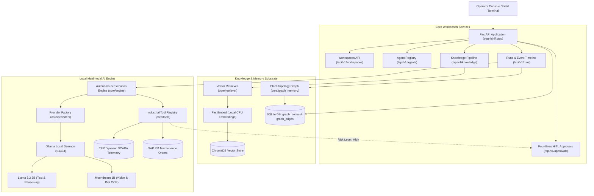

# CogniShift: Sovereign On-Premise Agentic AI Workbench

[](https://www.sih.gov.in/)
[](https://www.mrpl.co.in/)
[](https://www.python.org/)
[](https://fastapi.tiangolo.com/)
[](https://ollama.com/)
[]()
[]()

> **SIH 2024 Problem Statement SIH26117**  
> **Organization:** Mangalore Refinery and Petrochemicals Limited (MRPL)  
> **Title:** Sovereign On-Premise Agentic AI Workbench using Open-Weight Multimodal LLMs for Confidential Industrial Work  
> **Theme:** Smart Automation | **Category:** Software  

---

## Executive Overview

**CogniShift** is an industrial-grade, 100% on-premise agentic workbench engineered specifically for high-consequence petrochemical and refinery environments. It operates completely **air-gapped (zero external cloud dependencies)** to ensure that proprietary refinery schematics, standard operating procedures (SOPs), and operational telemetry never leave the enterprise perimeter.

### Core Architectural Pillars
1. **100% Sovereign (Zero Cloud Egress):** Powered by local open-weight models (`llama3.2:3b` for reasoning and `moondream:latest` for multimodal vision/OCR) running via Ollama directly on enterprise hardware (NVIDIA RTX 3050 GPU). Outbound cloud APIs (OpenAI, Gemini, Anthropic) are structurally prohibited.
2. **Hybrid GraphRAG & Vector Knowledge:** Combines page-aware PDF manual ingestion (FastEmbed `BAAI/bge-small-en-v1.5` + ChromaDB) with persistent **ISO 15926 / ISA-95 Plant Topology Graph Memory** (`graph_nodes` & `graph_edges` in SQLite) for multi-hop physical equipment reasoning.
3. **Authentic Industrial Data Stack:** Grounded in real-world petrochemical schemas:
   * **Tennessee Eastman Process (TEP):** Dynamic SCADA telemetry streams simulating nominal operation and multi-fault scenarios (e.g. `IDV(6)` reactor overpressure).
   * **SAP S/4HANA PM & ISO 14224:** Plant maintenance work orders with failure mode, damage, and cause coding (e.g. API 682 Plan 53A seal failure logs).
4. **Multimodal Computer Vision & Gauge OCR:** Native inspection of circular analog Bourdon pressure dials and stamped metallic equipment rating plates using local VLM inference.
5. **Four-Eyes Dual Authorization (HITL Safety Interlock):** Strict compliance with OISD-STD-106 and IEC 62443. High-risk actions (e.g. emergency pressure relief, motor restarts) automatically transition the execution engine into `paused` state until digitally authorized by a shift supervisor.
6. **Zero Arbitrary Code Execution:** All tool execution is strictly deterministic and parameterized with zero `subprocess.run`, `os.system`, `exec()`, or `eval()`.

---

## High-Level Architecture



---

## Quick Start Guide

### 1. Prerequisites
* **Python 3.12+**
* **NVIDIA GPU** (recommended 4GB+ VRAM; fully tested on NVIDIA GeForce RTX 3050 Laptop GPU)
* **Ollama** running locally on `http://localhost:11434` with:
  ```bash
  ollama pull llama3.2:3b
  ollama pull moondream
  ```

### 2. Installation
```bash
git clone https://github.com/sitanshukr08/CogniShift.git
cd CogniShift

# Create and activate virtual environment
python -m venv .venv
.venv\Scripts\activate   # Windows PowerShell
# source .venv/bin/activate  # Linux / macOS

# Install dependencies
pip install -r requirements.txt
```

### 3. Database Initialization & Seeding
```bash
# Copy configuration
copy .env.example .env

# Seed MRPL Refinery workspace, agents, tools, and plant topology
python scripts/seed.py
```

### 4. Running the Workbench Server
```bash
python -m uvicorn cognishift.app.main:app --host 127.0.0.1 --port 8000 --reload
```
* **Operator Console:** [http://127.0.0.1:8000](http://127.0.0.1:8000) (auto-redirects to `/static/index.html`)
* **Interactive API Docs (Swagger):** [http://127.0.0.1:8000/docs](http://127.0.0.1:8000/docs)
* **System Privacy & Sovereignty Status:** [http://127.0.0.1:8000/api/v1/system/privacy-status](http://127.0.0.1:8000/api/v1/system/privacy-status)

### 5. Running the Terminal CLI Workbench
CogniShift provides a standalone, rich terminal CLI supporting every system feature without requiring a browser:

```bash
# Launch interactive operator chat shell (REPL)
python cli.py chat

# Direct command examples
python cli.py status                               # System health & GPU diagnostics
python cli.py telemetry stream                     # Live SCADA sensor telemetry
python cli.py telemetry orders                     # SAP S/4HANA PM work orders
python cli.py graph query Pump-101A                # ISO 15926 topology multi-hop query
python cli.py knowledge search "MAWP limits"       # Vector RAG search with citations
python cli.py run execute "Check pressure on PT-101" # Autonomous agent run
python cli.py run execute "Inspect gauge" --image "data/vision_test/gauge_pressure_nominal_105psi.png" # Multimodal VLM
python cli.py approvals list                      # Four-Eyes HITL safety gate
python cli.py approvals approve <req_id>          # Supervisor digital sign-off
```

---

## Verification & Automated Benchmark Suites

CogniShift includes an extensive test suite verifying mathematical correctness, zero-cloud egress, and industrial state machine safety:

### 1. Unit & Schema Test Suite
```bash
pytest -v
```
*Validates database schema, WAL journaling, model providers, and API response serialization (10/10 passing).*

### 2. End-to-End Industrial Workflow Benchmark
```bash
python scratch/test_industrial_data_workflow.py
```
*Executes 5 sequential tests across ISO 15926 Topology, Tennessee Eastman Process surge (`IDV(6)`), SAP PM work order retrieval, HAZOP rule extraction, and Four-Eyes supervisor authorization.*

### 3. Multimodal Vision & Industrial OCR Benchmark
```bash
python scratch/test_multimodal_vision_pipeline.py
```
*Evaluates local `moondream` vision model on Bourdon analog pressure gauges (nominal vs. 485 PSI critical overpressure) and metallic equipment rating plates.*

---

## API Reference Overview

| Method | Endpoint | Description | Phase |
|:---|:---|:---|:---:|
| `GET` | `/api/v1/system/status` | System health, DB state, GPU Ollama connectivity | Phase 1 |
| `GET` | `/api/v1/system/privacy-status` | Cryptographic verification of air-gapped zero-cloud status | Phase 1 |
| `GET` | `/api/v1/workspaces` | List segregated industrial workspaces | Phase 2 |
| `POST` | `/api/v1/workspaces` | Provision new isolated refinery workspace | Phase 2 |
| `GET` | `/api/v1/agents` | List agents with tool allowlists & model bindings | Phase 2 |
| `POST` | `/api/v1/agents` | Register custom industrial agent | Phase 2 |
| `PATCH`| `/api/v1/agents/{id}` | Update agent system prompts and safety gates | Phase 2 |
| `POST` | `/api/v1/knowledge/upload` | Ingest PDF, extract text, and upsert ChromaDB vectors | Phase 4 |
| `GET` | `/api/v1/knowledge` | List ingested manuals and chunk metrics | Phase 4 |
| `DELETE`| `/api/v1/knowledge/{id}` | Purge document, physical file, and vector embeddings | Phase 4 |
| `GET` | `/api/v1/approvals` | View pending supervisor authorization requests | Phase 6 |
| `POST` | `/api/v1/approvals/{id}/approve`| Supervisor digital sign-off to resume execution | Phase 6 |
| `POST` | `/api/v1/approvals/{id}/reject` | Supervisor rejection of hazardous action | Phase 6 |
| `POST` | `/api/v1/runs` | Trigger agent reasoning loop (Text or Multimodal Image) | Phase 5 & 7 |
| `GET` | `/api/v1/runs` | List past execution runs and audit status | Phase 5 |
| `GET` | `/api/v1/runs/{id}` | Inspect specific run results and citations | Phase 5 |
| `GET` | `/api/v1/runs/{id}/events` | Stream complete event-sourced timeline | Phase 5 |
| `POST` | `/api/v1/runs/{id}/resume` | Resume paused run after supervisor sign-off | Phase 5 |

---

## Engineering Delivery Roadmap

| Phase | Component | Key Technologies | Status |
|:---|:---|:---|:---:|
| **Phase 1** | Foundation, Config & Air-Gap Enforcement | FastAPI, Pydantic v2, Python-dotenv | ✅ **Complete** |
| **Phase 2** | Database Layer & Foreign-Key Integrity | aiosqlite, SQLite WAL, CRUD Routers | ✅ **Complete** |
| **Phase 3** | Provider Abstraction & Local Ollama | httpx AsyncClient, ModelResponse Factory | ✅ **Complete** |
| **Phase 4** | Knowledge Pipeline & Vector RAG | FastEmbed (CPU), ChromaDB, PyPDF | ✅ **Complete** |
| **Phase 6** | Tool Registry & Four-Eyes Approvals | Deterministic simulations, HITL inbox | ✅ **Complete** |
| **Phase 5** | Autonomous Execution Engine | State Machine, Event Sourcing (`run_events`) | ✅ **Complete** |
| **Phase 7** | Multimodal Vision & Gauge OCR | Moondream 1B, Bourdon dial analysis | ✅ **Complete** |
| **Phase 8** | Enterprise Polish & Qualifier Demo | Full stack integration & scenario rehearsal | 🎯 **In Progress** |

---

## Detailed Documentation Suite

* **[ARCHITECTURE.md](ARCHITECTURE.md):** Industrial Purdue model, ISO 15926 ontology, and TEP data models.
* **[BENCHMARKS.md](BENCHMARKS.md):** Performance metrics, 500-page RAG stress tests, and VLM evaluation.
* **[information.md](information.md):** Complete Plain-English encyclopedia and operator walkthroughs.
* **[AGENTS.md](AGENTS.md):** Team handoff contracts and multi-agent alignment rules.
* **[implementation_plan.md](implementation_plan.md):** Master milestone specifications and tracking.
