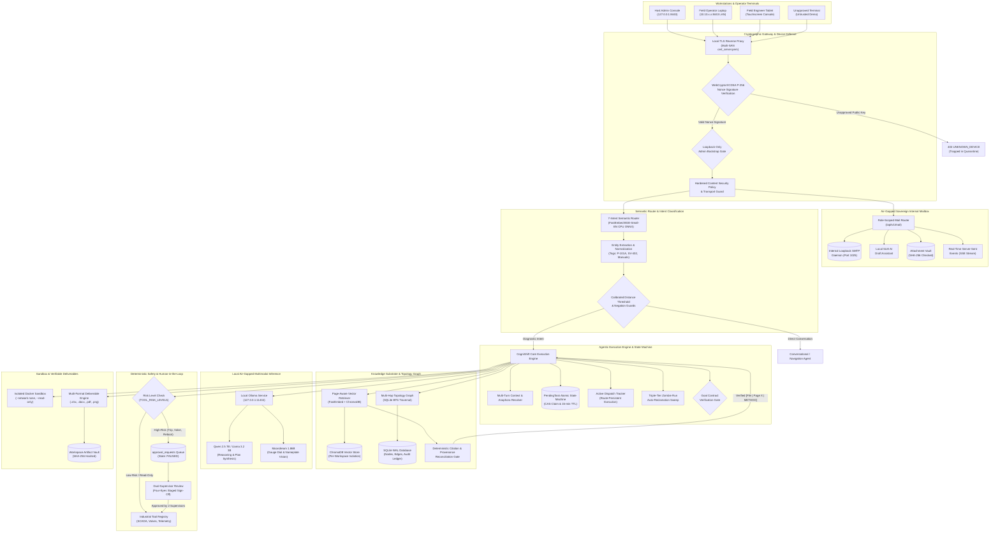

# CogniShift: Sovereign On-Premise Agentic AI Workbench for Industrial Operations

[](https://www.sih.gov.in/)
[](https://www.mrpl.co.in/)
[](https://www.python.org/)
[](https://fastapi.tiangolo.com/)
[](frontend/)
[](https://ollama.com/)
[](https://ollama.com/)
[](https://github.com/qdrant/fastembed)
[-lightgrey.svg)](https://www.trychroma.com/)
[-003B57.svg)](https://sqlite.org/)
[](tests/)
[]()
[-informational.svg)]()

**CogniShift** is an enterprise-grade, sovereign on-premise agentic AI workbench engineered for critical industrial processing facilities, oil & gas refineries, and air-gapped infrastructure. Developed for the Smart India Hackathon problem statement **SIH26117** in collaboration with **Mangalore Refinery and Petrochemicals Limited (MRPL)**, CogniShift operates entirely within a plant's physical boundary without external cloud dependencies.

All language models, visual language models, embedding pipelines, and vector indexes execute locally on plant edge hardware. Outbound egress is architecturally gated; device identities are bound to non-exportable browser WebCrypto private keys; physical plant actuator tools are governed by deterministic Human-in-the-Loop Four-Eyes dual-authorization gates; and evidence attribution is verified through a deterministic citation reconciliation engine.

---

## Table of Contents

1. [Problem Context & Industrial Motivation](#problem-context--industrial-motivation)
2. [Core Architectural Pillars](#core-architectural-pillars)
3. [End-to-End System Architecture](#end-to-end-system-architecture)
4. [Multi-Terminal LAN Deployment & WebCrypto Device Security](#multi-terminal-lan-deployment--webcrypto-device-security)
5. [Air-Gapped Sovereign Internal Mailbox System](#air-gapped-sovereign-internal-mailbox-system)
6. [Operator Command Console Hardening & Real-Time Ergonomics](#operator-command-console-hardening--real-time-ergonomics)
7. [Deep Dive: Core Engine Subsystems](#deep-dive-core-engine-subsystems)
   - [7.1. FastEmbed 7-Intent Semantic Router](#71-fastembed-7-intent-semantic-router)
   - [7.2. Multi-Turn Conversational Continuity & CAS Pending Tasks](#72-multi-turn-conversational-continuity--cas-pending-tasks)
   - [7.3. Industrial Plant Topology Graph Memory](#73-industrial-plant-topology-graph-memory)
   - [7.4. Four-Eyes Principle & Human-in-the-Loop Interlocks](#74-four-eyes-principle--human-in-the-loop-interlocks)
   - [7.5. Multimodal Document Processing, OCR & Citation Reconciliation](#75-multimodal-document-processing-ocr--citation-reconciliation)
   - [7.6. Multi-Format Deliverable Generation Pipeline](#76-multi-format-deliverable-generation-pipeline)
   - [7.7. Air-Gapped Code Execution Sandbox (Docker)](#77-air-gapped-code-execution-sandbox-docker)
   - [7.8. Multi-Tenant Workspace Isolation](#78-multi-tenant-workspace-isolation)
8. [Security Governance & Operational Authorizations](#security-governance--operational-authorizations)
9. [Network Sovereignty & Air-Gap Defense-in-Depth](#network-sovereignty--air-gap-defense-in-depth)
10. [REST API Reference](#rest-api-reference)
11. [Installation & Getting Started](#installation--getting-started)
12. [Automated Verification & Test Suite](#automated-verification--test-suite)
13. [Project Directory Layout](#project-directory-layout)
14. [Standards & Regulatory Compliance](#standards--regulatory-compliance)

---

## Problem Context & Industrial Motivation

Refineries, chemical manufacturing plants, and critical thermal utilities operate under rigorous statutory safety and cybersecurity regulations (OSHA 1910.119 Process Safety Management, OISD standards, IEC 62443). Their operational documentation—Piping & Instrumentation Diagrams (P&IDs), operating envelopes, standard operating procedures (SOPs), emergency relief parameters, and SCADA telemetry logs—contains sensitive trade secrets and critical infrastructure telemetry.

Traditional commercial cloud AI services present critical operational and legal risks in industrial environments:
* **Confidentiality Risks:** Transmitting process parameters, plant blueprints, and piping layouts to third-party cloud servers can conflict with corporate confidentiality and data residency mandates.
* **Loss of Availability:** External cloud outages or severed wide-area network (WAN) links leave plant control rooms without analytical assistance during plant upsets or emergencies.
* **Unconstrained Actuation:** Commercial LLMs cannot be granted direct access to control actuators or emergency trip valves without deterministic, hard-coded safety interlocks.
* **Hardware Impersonation:** Reusable bearer tokens stored in plaintext can be stolen and replayed from unauthorized laptops connected to the plant LAN.

**CogniShift resolves these challenges by executing sovereign agentic intelligence directly on plant-floor edge hardware.** Every token, embedding vector, image tensor, database transaction, and internal communication remains strictly on-premise.

---

## Core Architectural Pillars

* **Local Sovereign Execution:** Local sovereign execution with no public-cloud AI/model dependency in the demonstrated workflow. FastEmbed executes on CPU ONNX; Ollama serves local open-weight SLMs/VLMs; and internal messaging operates via a local loopback SMTP daemon.
* **Hardware-Bound WebCrypto Device Security:** Non-exportable browser-generated ECDSA P-256 keys. Every API transaction is validated via cryptographic challenge-response and bound to an approved physical terminal.
* **Deterministic Safety Interlocks (Four-Eyes Principle):** High-consequence actions (emergency pressure relief, pump transfer, equipment shutdown) cannot be triggered autonomously by model prose; they halt the execution state machine until two independent supervisors sign off.
* **Hybrid Knowledge Substrate:** Unifies dense semantic vector retrieval over technical manuals with multi-hop graph traversal over physical plant topology (equipment piping, instrumentation, and relief valves).
* **Deterministic Citation Reconciliation:** Automatically verifies model citations against authoritative retrieved document chunks, eliminating hallucinated page numbers and ensuring `sources_used` strictly reflects verified evidence.
* **Audited Multi-Turn State Machine:** Compare-And-Swap (CAS) atomic task resumption, safe user cancellations, 15-minute TTL expirations, and cross-turn pronoun and equipment resolution.
* **Verifiable Deliverable Synthesis:** Deterministically executes engineering calculations in isolated sandboxes and compiles publication-grade Excel workbooks, Word memos, PDFs, and telemetry charts sealed with SHA-256 checksums.

---

## End-to-End System Architecture



---

## Multi-Terminal LAN Deployment & WebCrypto Device Security

CogniShift includes a robust zero-trust cryptographic enrollment model designed for control room switches, industrial Wi-Fi networks, and isolated field subnets.

```
   [ PHYSICAL HOST STATION ]                      [ REMOTE OPERATOR LAPTOP ]
  (Admin Console / 127.0.0.1:8443)               (Field Laptop / 10.10.x.x:8443)
             │                                               │
    WebCrypto ECDSA P-256                           WebCrypto ECDSA P-256
      [ Private Key ]                                 [ Private Key ]
             │                                               │
   Challenge (32-byte nonce)                       Challenge (32-byte nonce)
             │                                               │
   Sign nonce -> Submit JWK                        Sign nonce -> Submit JWK
             ▼                                               ▼
┌───────────────────────────┐                   ┌───────────────────────────┐
│ Host Loopback Bootstrap   │                   │ LAN Remote Device Gate    │
│ • Role: Administrator     │                   │ • Unapproved by default   │
│ • IP: 127.0.0.1 (Loopback)│                   │ • Rejects with 403 until  │
│ ──► AUTOMATIC TRUST       │                   │   Host approves in UI     │
└───────────────────────────┘                   └───────────────────────────┘
```

1. **Browser-Generated ECDSA P-256 WebCrypto Keys:** Device identity is anchored in the client browser using the W3C WebCrypto API (`crypto.subtle.generateKey`). Keys are marked non-exportable and never traverse the network.
2. **Cryptographic Challenge-Response Protocol:**
   - The client requests a challenge from `/api/v1/auth/challenge`.
   - The server issues a high-entropy 32-byte cryptographically secure random nonce with a short validity TTL.
   - The browser signs the nonce using its private key:
     $$\text{Signature} = \text{ECDSA-Sign}(K_{\text{private}}, \text{nonce})$$
   - The server validates the signature against the registered public JWK stored in the `trusted_devices` table.
   - Upon successful verification, an authenticated, device-bound `X-Device-Session` token is issued.
3. **Loopback-Only Administrative Bootstrapping:** Root administrative elevation and new device approvals can **only** be executed from the physical loopback address (`127.0.0.1` / `::1`). Remote LAN terminals cannot self-elevate, preventing rogue devices on the subnet from compromising access governance.
4. **Automated Multi-SAN Local TLS:** Scripts synthesize a local Root Certificate Authority (`cognishift_demo_ca.crt`) and an X.509 server certificate with Subject Alternative Names (SANs) for `localhost`, `127.0.0.1`, and active local subnet IPv4 addresses.

---

## Air-Gapped Sovereign Internal Mailbox System

Industrial facilities require verifiable, auditable shift handovers and safety escalations without routing internal operations through public cloud email relays (Exchange, Google Workspace) or external SMTP providers.

```
 [ Operator Console ] ──► POST /api/v1/mail/send ──► [ Loopback SMTP (127.0.0.1:1025) ]
          │                                                       │
          ├─► AI Draft Assistant (Local SLM Handover Notes)       ├─► Store in aiosqlite
          ├─► Multi-Recipient (TO / CC / BCC Dispatch)            ├─► Per-Recipient Read Tracking
          └─► Attachment Vault (SHA-256 Checked)                  └─► Real-Time SSE Stream
```

* **Loopback SMTP Daemon (`aiosmtpd`):** Built-in asynchronous RFC-compliant SMTP server bound exclusively to `127.0.0.1:1025`. All internal communications remain strictly on-device.
* **Role-Scoped Persona Directory:** Pre-configured plant operational roles: Operations Engineer, Control Room Supervisor, Safety Officer, and Plant Administrator.
* **Granular Read Receipts:** Independent per-recipient tracking records exact timestamps (`read_at`), ensuring verifiable auditability during critical shift transitions.
* **Local SLM AI Draft Assistant:** Operators draft structured incident notices and shift handovers using the local Ollama LLM (`POST /api/v1/mail/draft/assist`). Output is strictly grounded in plant operating procedures.
* **Attachment Security Gating:** Only authorized document formats (`.pdf`, `.docx`, `.xlsx`, `.csv`, `.txt`, `.png`, `.jpg`) are permitted. Executable and script payloads (`.exe`, `.bat`, `.ps1`, `.sh`) are rejected immediately. Every attachment is hashed via SHA-256 upon upload and verified prior to download.
* **Real-Time Server-Sent Events (SSE):** Live notifications push instant alerts to connected operator terminals over `GET /api/v1/mail/events`.

---

## Operator Command Console Hardening & Real-Time Ergonomics

The Operator Console is hardened to ensure continuous operations under multi-tab navigation, network blips, or sudden process crashes:

```
 [ Operator Command Input ]
             │
   Active Dispatch Tracker (Module-Level activeDispatches Map)
             │  ├── Survives Client Route Switching (Operator ◄► Mail ◄► Workspaces)
             │  └── 1000ms Live Polling Fallback & Event Streaming
             ▼
   Triple-Tier Zombie Run Reclamation Subsystem
             ├── 1. Startup Lifespan Sweep (Reclaims interrupted runs on boot)
             ├── 2. Background Auto-Reclamation (Fails runs > 10 min old)
             └── 3. Client Recency Filter (Ignores stale runs > 5 min old)
             ▼
   Emergency Escape Hatches
             ├── "+ New Command" (Bypasses active execution state)
             ├── "Reset Console" (Purges stuck local state & unlocks input)
```

* **Active Dispatch Tracker:** Preserves in-flight task execution across SPA route transitions, preventing loss of context when operators navigate between pages.
* **Triple-Tier Zombie Run Reclamation:** Server startup sweeps reclaim stale `running` runs left by sudden workstation restarts; background sweeps terminate orphan processes; and client recency filters discard abandoned sessions.
* **Emergency Escape Hatches:** Dedicated operator UI controls ("+ New Command" and "Reset Console") allow operators to force-clear local UI state if an unexpected edge condition locks the interface.

---

## Deep Dive: Core Engine Subsystems

### 7.1. FastEmbed 7-Intent Semantic Router
Incoming operator input is classified locally using FastEmbed CPU ONNX embeddings (`BAAI/bge-small-en-v1.5`) across 7 distinct intents:

| Intent | Target Scope | Example Prompt |
| :--- | :--- | :--- |
| `CONVERSATION` | Direct greeting, system capabilities, operational help | *"What tools are available to you?"* |
| `KNOWLEDGE_QUERY` | SOP manuals, P&IDs, equipment operating envelopes | *"What is the minimum suction pressure for P-101A?"* |
| `ARTIFACT_INSPECTION` | Inspecting existing CSV/JSON/telemetry deliverables | *"Analyze the latest vibration log in our workspace"* |
| `CODE_EXECUTION` | Quantitative data calculations and data processing | *"Calculate the remaining wall thickness trend in Python"* |
| `CONTROL_ACTION` | Operating simulated actuators, valves, or pumps | *"Emergency open relief valve SV-402 on Separator V-102"* |
| `UI_NAVIGATION` | Client page routing instructions | *"Take me to the shift handover mailbox"* |
| `COMPLEX_AGENT` | Multi-step diagnostics requiring plan decomposition | *"Investigate why suction pressure dropped and vibration spiked"* |

The router applies entity decoupling (normalizing tags such as `P-101A` or `SV-402`) and calibrated cosine distance thresholds (`<= 0.78`) to reject distractor context and prevent cross-intent misrouting.

### 7.2. Multi-Turn Conversational Continuity & CAS Pending Tasks
To support complex multi-turn operational conversations:
* **Atomic CAS State Machine:** Resuming paused tasks uses Compare-And-Swap (CAS) database transactions (`claim_pending_task_atomic`), preventing race conditions when multiple operators view the same pending approval.
* **15-Minute TTL:** Pending approval requests expire automatically after 15 minutes, failing closed to prevent stale commands from executing unexpectedly.
* **Context & Anaphora Resolver:** Resolves conversational pronouns (*"do it"*, *"confirm that"*, *"cancel that"*) and connects follow-up queries to prior equipment and documents discussed in the session.

### 7.3. Industrial Plant Topology Graph Memory
Industrial plants cannot be represented by vector similarity alone; physical fluid streams, upstream vessels, and safety interlocks follow structural topologies:
* **Relational Schema:** Node entities (`EQUIPMENT`, `SENSOR`, `VALVE`) and directed relationship edges (`FEEDS_INTO`, `PROTECTED_BY`, `MEASURED_BY`) stored in SQLite.
* **Multi-Hop Traversal:** BFS graph exploration traverses up to 3 hops from a specified equipment tag (e.g. finding that `P-101A` discharges into `V-102`, which is protected by `SV-402`).
* **Grounding Gate:** Cross-references model reasoning against validated topological paths to prevent hallucinating nonexistent connections between plant units.

### 7.4. Four-Eyes Principle & Human-in-the-Loop Interlocks
CogniShift enforces a central risk classification matrix across all registered industrial tools:

| Registered Tool | Risk Classification | Execution Mode | Required Authorizations |
| :--- | :--- | :--- | :--- |
| `read_sensor_telemetry` | `read_only` | Autonomous | 0 (Auto-executes) |
| `read_pump_curve` | `read_only` | Autonomous | 0 (Auto-executes) |
| `run_diagnostic` | `low_risk` | Autonomous | 0 (Auto-executes) |
| `execute_code` (sandbox) | `sensitive` | Autonomous / Supervised | Governed by agent policy |
| `restart_component` | `sensitive` | **Four-Eyes Interlock** | **2 Independent Supervisors** |
| `emergency_pressure_relief` | `service_interrupting` | **Four-Eyes Interlock** | **2 Independent Supervisors** |
| `restart_service` | `service_interrupting` | **Four-Eyes Interlock** | **2 Independent Supervisors** |

High-consequence tools automatically pause the execution loop, emit an `approval_request` record, and notify supervisors. Dual independent signatures (`reviewed_by` and `reviewed_by_2`) are strictly enforced; self-approval by the requesting operator is rejected.

### 7.5. Multimodal Document Processing, OCR & Citation Reconciliation
Engineering documents and field photos are ingested via a unified multimodal pipeline:

```
                            [ Ingested Document / Photo ]
                                          │
                    ┌─────────────────────┼─────────────────────┐
                    ▼                     ▼                     ▼
             [ Vector PDF ]        [ Scanned Blueprint ]   [ Field Photo ]
                    │                     │                     │
                  pypdf                RapidOCR            Moondream VLM
               Native Text            Local OCR         Gauge Dial & Tag OCR
                    │                     │                     │
                    └─────────────────────┼─────────────────────┘
                                          ▼
                      [ Dense Embedding & ChromaDB Storage ]
                                          │
                                          ▼
                   [ Model Generation & Final Answer Proposal ]
                                          │
                                          ▼
              [ Deterministic Citation & Provenance Reconciliation Gate ]
                • Snaps hallucinated page numbers to retrieved evidence
                • Normalizes syntax to [Filename | Page X | METHOD]
                • Populates sources_used strictly with verified citations
```

1. **Digital PDF Triage:** Rapid lossless text extraction with strict 1-based page boundary preservation.
2. **Local OCR Fallback:** RapidOCR ONNX model extracts text from scanned P&IDs and blueprints on CPU/GPU.
3. **Local Gauge Vision:** Moondream 1.86B visual language model interprets analog gauge dial positions, needle angles, pressure units, and equipment nameplate serial stamps.
4. **Deterministic Citation Reconciliation Gate:**
   - Evaluates citations from both `FinalAnswer.citations` and inline text.
   - Cross-references cited documents and page numbers against the authoritative catalog of retrieved chunks.
   - Snaps out-of-range or hallucinated page numbers back to the true retrieved page.
   - Sets `sources_used` strictly to the verified citations that grounded the final response.
   - Retains verified manual citations under `## Documented SOP & Baseline Evidence` in heavy-reasoning root cause analyses.

### 7.6. Multi-Format Deliverable Generation Pipeline
Calculations executed by agents are compiled into formal, verified engineering deliverables:
* **Spreadsheets (`.xlsx` via `openpyxl`):** Formatted engineering workbooks with calculation formulas, status highlights, and header styling.
* **Engineering Memos (`.docx` via `python-docx`):** Standard corporate memos with executive summaries, telemetry tables, and sign-off sections.
* **Audit Documents (`.pdf` via `reportlab`):** Publication-grade PDF audit reports with headers, running footers, and table grids.
* **Visualizations (`.png` via `matplotlib`):** High-resolution telemetry trend plots and sensor excursion charts.
* **Integrity Hashing:** Every generated artifact is stamped with a SHA-256 checksum in SQLite. File downloads verify on-disk hashes against the ledger to guarantee immutability.

### 7.7. Air-Gapped Code Execution Sandbox (Docker)
When data analysis or mathematical verification requires code execution, the agent delegates to an isolated container:

```bash
docker run --rm \
  --network none \
  --read-only \
  --memory 512m \
  --pids-limit 64 \
  --user 10001:10001 \
  --volume <scratch_dir>:/workspace:rw \
  cognishift/sandbox-python:3.12-v1 python /workspace/main.py
```

* `--network none` ensures absolute isolation from external networks.
* The root filesystem is read-only; execution is strictly restricted to a temporary workspace volume.
* Self-debugging loops capture stdout/stderr to perform bounded error repair if code execution encounters syntax or runtime errors.

### 7.8. Multi-Tenant Workspace Isolation
Industrial facilities segregate plant units (e.g., Crude Distillation Unit vs. Hydrotreater):
* **Database Isolation:** Foreign keys enforce strict workspace boundaries across runs, agents, tools, artifacts, and approval queues.
* **Vector Isolation:** Each workspace maintains its own dedicated ChromaDB collection (`workspace_{id}`).
* **Filesystem Quarantine:** Ingested documents and generated artifacts reside in separate per-workspace directories (`data/workspaces/{id}/`).

---

## Security Governance & Operational Authorizations

In addition to state machine tool interlocks, CogniShift includes a formal **Temporary Operational Authorization (Permit-to-Work)** framework (`/api/v1/authorizations`):
* **Time-Bounded Operational Windows:** Permits grant authorized operators time-limited access (5 to 1440 minutes) to perform maintenance or run diagnostics on specific plant equipment.
* **Staged Dual Approval:** Permits transition through `SUBMITTED` -> `STAGE_1_APPROVED` (Supervisor 1) -> `APPROVED` (Supervisor 2).
* **Atomic Permit Consumption:** When an authorized action is triggered, an atomic database transition claims the permit, preventing replay or duplicate actuation.
* **Tamper-Evident Audit Ledger:** All permit requests, signature events, revocations, and device registrations are logged in the append-only `audit_events` table.

---

## Network Sovereignty & Air-Gap Defense-in-Depth

CogniShift applies defense-in-depth across three architectural layers:

```
[ LAYER 1: Application Pre-Socket Transport Guard ]
  • SovereignAsyncTransport intercepts outbound HTTP calls before TCP handshake.
  • Enforces loopback-only destinations (127.0.0.1, ::1 on ports 8000, 8443, 1025, 11434).
  • All external domains, public IPs, and unapproved WAN destinations are rejected instantly.

[ LAYER 2: Operating System Kernel Firewall ]
  • Process-scoped Windows Defender Firewall rules bind python.exe.
  • Outbound traffic to WAN/public IP space is blocked at the kernel network stack.
  • Configured via scripts/enable_lan_server_policy.ps1 or scripts/enable_strict_network_policy.ps1.

[ LAYER 3: Independent Host-Level Observer ]
  • scripts/observe_network.py polls the OS socket table via psutil.
  • Verifies zero unauthorized external sockets during live operation.
```

---

## REST API Reference

| Category | Method | Endpoint | Description |
| :--- | :--- | :--- | :--- |
| **Authentication** | `GET` | `/api/v1/auth/challenge` | Request 32-byte cryptographic nonce for WebCrypto challenge |
| | `POST` | `/api/v1/auth/device-session` | Validate ECDSA P-256 signature and issue trusted device token |
| **Workspaces** | `GET` | `/api/v1/workspaces` | List authorized plant workspaces |
| | `POST` | `/api/v1/workspaces` | Provision a new isolated plant workspace |
| **Agents** | `GET` | `/api/v1/agents` | List agent configurations and assigned tool permissions |
| | `POST` | `/api/v1/agents` | Register a new specialized agent definition |
| **Knowledge** | `POST` | `/api/v1/knowledge/upload` | Ingest PDF/SOP with page-aware chunking and FastEmbed vectors |
| | `GET` | `/api/v1/knowledge` | List indexed knowledge sources, chunk counts, and versions |
| | `DELETE`| `/api/v1/knowledge/{id}` | Purge knowledge document and associated ChromaDB vector chunks |
| **Execution Runs**| `POST` | `/api/v1/runs` | Submit an operational query or agent task |
| | `GET` | `/api/v1/runs/{id}` | Fetch run status, structured plan, execution timeline, and citations |
| | `POST` | `/api/v1/runs/{id}/resume` | Resume a paused run after supervisor sign-off |
| **Approvals** | `GET` | `/api/v1/approvals` | List pending high-risk tool approval requests |
| | `POST` | `/api/v1/approvals/{id}/approve` | Record supervisor sign-off (Four-Eyes dual signature) |
| | `POST` | `/api/v1/approvals/{id}/reject` | Reject action proposal and terminate run safely |
| **Artifacts** | `GET` | `/api/v1/artifacts` | List generated deliverables with SHA-256 checksums |
| | `GET` | `/api/v1/artifacts/{id}/download` | Download deliverable with tamper verification check |
| **Internal Mail** | `GET` | `/api/v1/mail/inbox` | List internal shift handovers and safety alerts |
| | `POST` | `/api/v1/mail/send` | Send internal message via loopback SMTP daemon |
| | `POST` | `/api/v1/mail/draft/assist` | Generate shift handover draft using local SLM |
| | `GET` | `/api/v1/mail/events` | Real-time Server-Sent Events (SSE) inbox stream |
| **Authorizations**| `GET` | `/api/v1/authorizations` | List operational permits and staged approval states |
| | `POST` | `/api/v1/authorizations` | Request time-bounded operational permit |
| | `POST` | `/api/v1/authorizations/{id}/approve` | Sign off on operational permit (Supervisor 1 or 2) |

---

## Installation & Getting Started

### System Prerequisites
* **Operating System:** Windows 10/11, Ubuntu 22.04 LTS, or Debian 12 (local sovereign edge runtime support)
* **Python:** 3.12+ (64-bit)
* **Node.js:** 20+ and npm 10+
* **Local Inference:** [Ollama](https://ollama.com/) installed and running locally with models:
  ```bash
  ollama pull qwen2.5:7b
  ollama pull llama3.2:3b
  ollama pull moondream
  ```

### 1. Clone & Virtual Environment Setup
```bash
git clone https://github.com/sitanshukr08/CogniShift.git
cd CogniShift

python -m venv .venv
# On Windows:
.venv\Scripts\activate
# On Linux:
source .venv/bin/activate

pip install -r requirements.txt
```

### 2. Environment Configuration
Copy the default environment template:
```bash
cp .env.example .env
```
Key default configuration parameters:
* `OPERATING_MODE=local` (Enforces sovereign air-gapped operation)
* `FASTEMBED_OFFLINE=true` (Prevents external model downloads)
* `OLLAMA_BASE_URL=http://localhost:11434`
* `CHROMA_PATH=./data/chroma`
* `SQLITE_PATH=./data/cognishift.db`

### 3. Launch the Backend Server
```bash
uvicorn cognishift.app.main:app --host 127.0.0.1 --port 8000
```

### 4. Launch the Operator Web Console
In a separate terminal:
```bash
cd frontend
npm install
npm run dev
```
Open `http://localhost:5173` in a modern browser. The web console will automatically generate an ECDSA P-256 key pair and register the browser as a trusted workstation.

---

## Automated Verification & Test Suite

CogniShift includes an automated test suite comprising 550+ unit, integration, and security tests:

```bash
# Run entire test suite:
pytest tests/ -v

# Run citation accuracy and provenance reconciliation tests:
pytest tests/test_single_provenance_and_grounding.py -v

# Run conversational grounding and knowledge scoping tests:
pytest tests/test_conversational_protocol.py tests/test_knowledge_boundary.py -v

# Run engine state machine and tool calling tests:
pytest tests/test_engine.py tests/test_phase2a_tool_calling.py tests/test_phase2b_agent_loop.py -v

# Run network sovereignty and egress defense tests:
pytest tests/test_phase0_security.py tests/test_phase6_browser_egress.py -v
```

---

## Project Directory Layout

```
CogniShift/
├── config/                 # System configuration and firewall rule definitions
├── data/                   # Local SQLite database (WAL mode) and ChromaDB store
├── demo/                   # Synthetic refinery manuals, telemetry spreadsheets, P&IDs
├── docs/                   # Engineering documents, workflows, and presentation vector PDF
│   ├── CogniShift_SIH2026_Final_v2.pdf
│   ├── DETAILED_PROJECT_WORKFLOW.md
│   ├── DETAILED_TECH_STACK.md
│   ├── PROJECT_ABSTRACT.md
│   └── RESEARCH_AND_REFERENCES.md
├── frontend/               # React 19 + Vite + Tailwind v4 operator console
│   ├── src/
│   │   ├── api/            # API client bindings for all backend routes
│   │   ├── components/     # High-contrast industrial UI components
│   │   ├── pages/          # OperatorPage, MailPage, RunsPage, SecurityPage
│   │   └── lib/            # WebCrypto ECDSA device key management
│   └── package.json
├── scripts/                # Administrative utilities, TLS generation, and demo seeding
├── src/cognishift/         # Core application package
│   ├── __main__.py         # Package entry point (uvicorn runner)
│   ├── app/                # FastAPI application layer
│   │   ├── api/            # Route controllers (runs, knowledge, approvals, mail)
│   │   └── db/             # Async SQLite schema, connection lifecycle, models
│   └── core/               # Agentic core engine
│       ├── engine.py       # Execution loop, citation reconciliation, goal contracts
│       ├── retriever.py    # Page-aware dense retrieval and ChromaDB querying
│       ├── tools.py        # Industrial tool definitions and simulated plant actuators
│       ├── tool_schemas.py # Pydantic v2 action schemas and repair logic
│       ├── semantic_router.py # 7-intent FastEmbed semantic classifier
│       └── document_processing/ # Multimodal extractor, OCR, provenance tracking
├── tests/                  # 550+ automated unit, regression, and security tests
├── requirements.txt        # Python dependency manifest
└── pytest.ini              # Test runner configuration
```

---

## Standards & Regulatory Compliance

* **IEC 62443 (Security for Industrial Automation and Control Systems):** Complies with Purdue Model Level 3/3.5 DMZ operational requirements through network isolation, fail-closed access policies, and WebCrypto device enrollment.
* **OSHA 1910.119 (Process Safety Management of Highly Hazardous Chemicals):** Enforces mandatory Human-in-the-Loop Four-Eyes dual-supervisor authorization prior to executing any actuator command that impacts the plant operating envelope.
* **Digital Personal Data Protection (DPDP) Act 2023:** Supports strict data residency requirements by keeping all telemetry, incident reports, and operational logs on-premise without external transmission.
