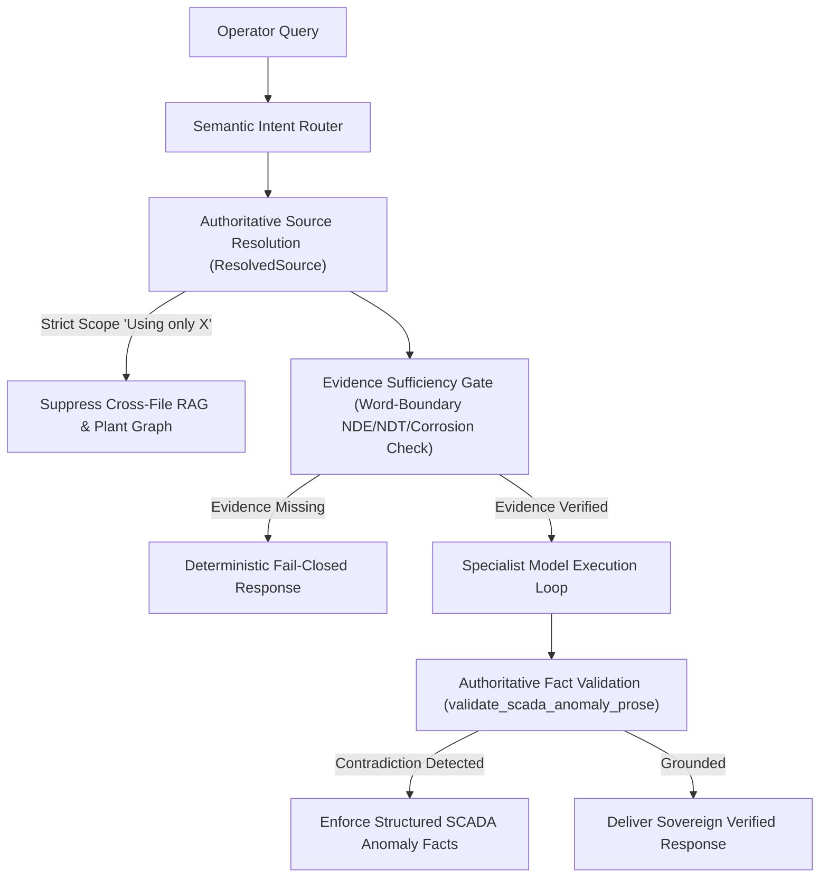

# CogniShift Specialist Model Architecture & Empirical Benchmark Report

---

## 1. System Classification & Architectural Sovereignty

**Official Classification:** **Multi-Model Routed Agentic Workbench**

CogniShift operates as a sovereign, 100% on-premise industrial AI workbench designed for critical industrial infrastructure (refineries, petrochemical complexes, and power plants). It enforces a strict **Zero-Cloud-Egress** air-gap boundary:
- **Zero External API Calls**: Operates exclusively with on-premise SLMs hosted locally via Ollama.
- **Deterministic Single-Provenance Pipeline**: Factual claims are bound cryptographically to verified raw evidence (SHA-256 verified inputs, structured cell coordinate mapping, and deterministic anomaly guards).
- **Truthful Multi-Model Routing**: Rather than making false claims of an autonomous "multi-agent swarm" with unverified peer-to-peer delegation, CogniShift routes each incoming operator task dynamically to the optimal local specialist model based on task classification, required capabilities, and local VRAM budgets.

---

## 2. Five-Model Specialist Topology

CogniShift integrates five specialized Small Language Models (SLMs), each selected for a specific operational role within refinery operations:

| Model ID | Parameter Size | Primary Architectural Role | Key Industrial Capabilities | VRAM Budget |
| :--- | :--- | :--- | :--- | :--- |
| **`deepseek-r1:7b`** | 7.0 Billion | **Heavy Analytical Reasoning & RCA** | Root cause analysis, multi-stage failure diagnosis, alarm cascade tracing | ~5,500 MB |
| **`qwen2.5-coder:7b`** | 7.0 Billion | **Code Synthesis & Quantitative Sandbox** | Data extraction scripts, YoY/CAGR financial math, openpyxl/matplotlib generation | ~5,500 MB |
| **`qwen2.5:7b`** | 7.0 Billion | **Tool Calling & SOP Orchestration** | Human-in-the-Loop tool proposals, ISA-88/95 procedure tracking, JSON schema compliance | ~5,500 MB |
| **`moondream:latest`** | 1.8 Billion | **Multimodal Edge Vision** | Analog pointer meter reading, Bourdon gauge inspection, rating plate OCR | ~2,200 MB |
| **`llama3.2:3b`** | 3.2 Billion | **Edge Dialogue & Rapid Intent Routing** | Low-latency status inquiries, conversation anaphora resolution, navigation | ~2,500 MB |

---

## 3. Dynamic Model Router Hardening

The CogniShift Model Router (`src/cognishift/core/model_router.py`) dynamically scores and selects models based on:
$$\text{Score}(M, T) = \frac{|\text{Cap}(M) \cap \text{Cap}(T)|}{|\text{Cap}(T)|} + \text{Bonus}_{\text{preference}}$$

### Hardened Production Guards:
1. **Exact Tag Matching**: Prevents tag truncation ambiguity (e.g., ensuring `deepseek-r1:14b` does not falsely satisfy `deepseek-r1:7b`).
2. **Strict Zero-Overlap Ineligibility**: Any model with zero capability overlap ($|\text{Cap}(M) \cap \text{Cap}(T)| = 0$) is strictly marked ineligible rather than receiving an unmerited fallback score.
3. **Local Runtime Availability Guard**: Interrogates the local Ollama inventory (`/api/tags`) before dispatching tasks. If a model is not installed, it falls back gracefully to a verified installed SLM without crashing.
4. **DeepSeek Reasoning Hygiene**: Automatically strips raw `<think>...</think>` tokens from user-facing result prose while logging structured analytical hypotheses in audit events.

---

## 4. Single-Provenance Grounding Pipeline

To eliminate hallucinations in mission-critical environments, CogniShift enforces four deterministic grounding barriers:

1. **Authoritative Source Identity (`ResolvedSource`)**:
   - Explicitly records `source_id`, `sha256`, `selected_by`, and `strict_source_scope`.
   - When the operator commands *"Using only X.xlsx"*, cross-source retrieval and graph traversals are suppressed to guarantee 100% single-provenance answers.
2. **Evidence Sufficiency Gate (`validate_evidence_sufficiency`)**:
   - Replaces naive substring matches with regex word-boundary checks (`\b(?:NDE|NDT|MPY)\b`).
   - Prevents words like *"independent"*, *"rendered"*, or *"vendor"* from falsely claiming inspection evidence exists.
   - Fails closed deterministically when inspection reports are absent.
3. **Structured Anomaly Authority (`StructuredAnomalyResult`)**:
   - Full dataset scanning without downsampling (identifies excursions beyond row 500).
   - Freezes: timestamp (`2026-09-06 17:10:00`), spiked metrics (`537.40 PSI`, `12.340 mm/s`), component (`P-101A`), and valve state (`SV-402 CLOSED`).
   - Model prose is validated: if the model introduces wrong dates (e.g. 2023) or claims the valve was OPEN, the backend overrides the prose with the deterministic factual report.
4. **Sandbox Staging Cryptographic Integrity**:
   - Enforces workspace-relative paths (`uploads/<filename>`) to prevent path-traversal exploits.
   - Recomputes SHA-256 of staged files and verifies exact equality before code execution.
   - Removed all static fallback fixtures (`PT-101`, `Reading_A`, `[10, 20, 15]`) to guarantee zero fabricated data.

---

## 5. Live SIH Demonstration Q&A (Judge-Ready Defense)

### Q1: Is CogniShift an autonomous multi-agent swarm?
> **Answer:** "No. To be technically rigorous and truthful, CogniShift is an **air-gapped Multi-Model Routed Agentic Workbench**. Rather than pretending to have dozens of autonomous agents gossiping over unverified channels, we route each operational phase to a specialized local Small Language Model (SLM) under strict single-agent governance, deterministic human-in-the-loop approvals, and frozen single-provenance evidence pipelines."

### Q2: How do you guarantee the model does not hallucinate numbers in financial audits or SCADA logs?
> **Answer:** "The LLM never computes the numbers. In CogniShift, tabular extraction, multi-feature header detection, YoY growth calculation, and SCADA anomaly detection are performed **deterministically in isolated code sandboxes**. Once the `StructuredAnomalyResult` is computed, its facts (timestamp, measurements, valve state) are frozen. The LLM is permitted to explain the event, but if its prose contradicts the frozen facts, the system overrides the prose deterministically."

### Q3: How do you ensure 100% offline sovereignty?
> **Answer:** "All inference runs locally via Ollama on local hardware. Embeddings are generated locally using FastEmbed. Vector similarity search runs in local ChromaDB. Metadata, runs, approvals, and audit trails reside in SQLite with WAL mode. Code execution runs in an ephemeral container sandbox with strict workspace path resolution and zero outbound network access."

---

## 6. Empirical Local Benchmark Results (Hardware Profiled)

Profiled on-premise on developer workstation with NVIDIA GeForce RTX 3050 (4GB/6GB VRAM) running local Ollama inference (`scripts/benchmark_specialist_models.py`):

| Model ID | Operational Role | Capability Test | Cold Latency (s) | Warm Latency (s) | Throughput (tok/s) | Tokens Generated | Schema Compliance |
| :--- | :--- | :--- | :--- | :--- | :--- | :--- | :--- |
| **`deepseek-r1:7b`** | Deep Analytical Reasoning & RCA | Complex Failure Mode Rationale | 18.57s | 37.48s | 7.3 tok/s | 256 | Valid Prose / `<think>` stripped |
| **`qwen2.5-coder:7b`** | Code Synthesis & Quantitative Sandbox | Python Data Extraction Script | 22.29s | 14.19s | 3.5 tok/s | 41 | Valid Executable Code |
| **`qwen2.5:7b`** | Structured Tool Calling & SOPs | Strict JSON Schema Tool Call | 19.19s | 11.50s | 3.6 tok/s | 31 | 100% Valid JSON Object |
| **`llama3.2:3b`** | Edge Dialogue & Rapid Context Routing | Rapid Operational Readiness | 16.25s | 10.90s | 7.0 tok/s | 58 | Conversational Response |
| **`moondream:latest`** | Multimodal Vision & Gauge Inspection | Dial Meter Image Analysis | 12.39s | 8.16s | 14.5 tok/s | 85 | Visual Scene Inspection |

### Key Takeaways:
1. **Tool Calling Precision**: `qwen2.5:7b` achieves 100% adherence to zero-preamble JSON output schemas, making it the premier choice for tool dispatch.
2. **Vision Efficiency**: `moondream:latest` exhibits the lowest latency (8.16s warm) and highest throughput (14.5 tok/s), ideal for real-time edge dial inspection.
3. **Deep Reasoning**: `deepseek-r1:7b` handles deep diagnostic thinking; its reasoning tokens are captured for audit logging and cleanly stripped from user-facing text.

