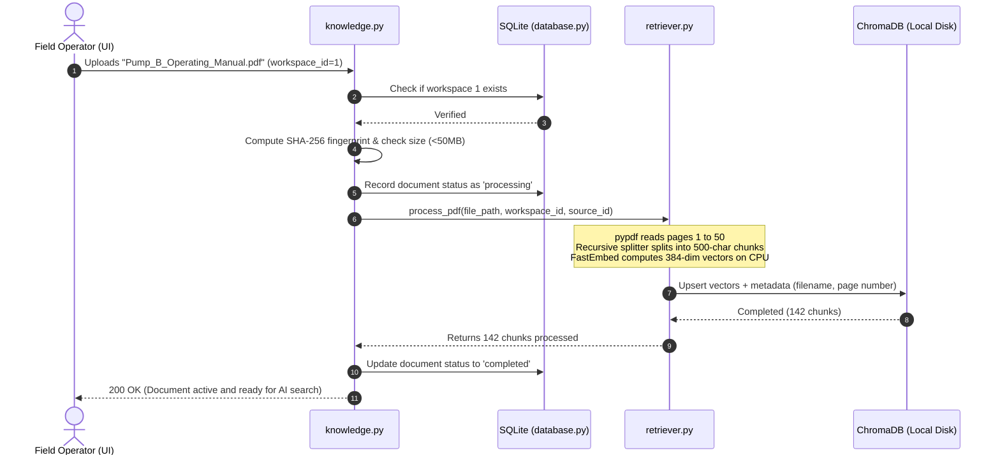

# CogniShift: Complete Team Guide & Project Encyclopedia

> **Welcome to the CogniShift Team Guide!**  
> This document explains **what this project is**, **why we are building it**, and **how every single file in the repository works** in plain, simple English. Whether you are working on the backend, building the web UI, or presenting to the hackathon judges, this guide gives you the complete picture.

---

## Table of Contents
1. [The Big Picture: What is CogniShift?](#1-the-big-picture-what-is-cognishift)
2. [The 5 Mental Models (How It All Works)](#2-the-5-mental-models-how-it-all-works)
3. [File-by-File Encyclopedia (What, Why, and How)](#3-file-by-file-encyclopedia)
4. [Interactive Walkthrough & Simulation Scenarios](#4-interactive-walkthrough--simulation-scenarios)
5. [Team Cheat Sheet for Hackathon Presentations](#5-team-cheat-sheet-for-hackathon-presentations)

---

## 1. The Big Picture: What is CogniShift?

### The Problem (SIH26117 - MRPL)
**Mangalore Refinery and Petrochemicals Limited (MRPL)** operates massive, complex industrial equipment (crude oil distillation towers, high-pressure catalytic crackers, pumps, and valves). 

When a field technician or shift supervisor is on duty:
1. They need answers from thousands of pages of confidential technical manuals, safety standards (OISD), and equipment specs.
2. They need an AI assistant that can help diagnose anomalies (like a pressure drop or motor overheating) and recommend actions.
3. **The Huge Catch:** **They CANNOT use ChatGPT, Gemini, or Claude.** Sending confidential refinery schematics, passwords, or live sensor readings to external cloud servers is a catastrophic national security and intellectual property risk.
4. **The Second Catch:** The AI cannot be allowed to execute actions on real refinery equipment without a human supervisor checking and approving it first (Human-in-the-Loop).

### Our Solution: CogniShift
CogniShift is a **Sovereign, On-Premise Agentic AI Workbench**:
* **Sovereign / On-Premise:** It runs 100% offline inside the plant's private network. All AI reasoning is handled by open-weight models (`llama3.2:3b` and `moondream`) running locally on company GPUs via Ollama.
* **Agentic Workbench:** It doesn't just chat; it has specialized AI "Agents" (like a *Maintenance Assistant* or an *IT Helpdesk Agent*) equipped with specific tools and reading materials.
* **Safe:** High-risk actions (like emergency flare venting or restarting a pump) are automatically caught by a safety net and paused until an engineer clicks "Approve."

---

## 2. The 5 Mental Models (How It All Works)

Think of CogniShift like a modern high-security refinery control room:

```
+-------------------------------------------------------------------------------+
|  1. THE RECEPTIONIST (FastAPI / main.py)                                       |
|     Greets incoming requests, validates tokens, routes visitors to desks.     |
+---------------------------------------+---------------------------------------+
                                        |
        +-------------------------------+-------------------------------+
        |                                                               |
+-------v-------------------------------+       +-----------------------v-------+
|  2. THE FILING CABINET                |       |  3. THE TECHNICAL LIBRARY     |
|     (SQLite / database.py, models.py) |       |     (RAG / retriever.py)      |
|     Stores all registered agents,     |       |     Takes PDF manuals, chunks |
|     workspaces, tool definitions,     |       |     them, and provides page   |
|     and past approval logs.           |       |     citations in 20ms.        |
+---------------------------------------+       +-------------------------------+
        |                                                               |
        +-------------------------------+-------------------------------+
                                        |
+---------------------------------------v---------------------------------------+
|  4. THE LOCAL BRAIN (core/providers.py & ollama_provider.py)                 |
|     The local LLM (Llama 3.2 3B / Moondream). Runs strictly on local GPU.     |
|     Has zero internet cables connected.                                       |
+---------------------------------------+---------------------------------------+
                                        |
+---------------------------------------v---------------------------------------+
|  5. THE TOOLBELT & SAFETY HANDCUFFS (core/tools.py & approvals.py)            |
|     Can check pressure or test diagnostics. If it tries to perform an         |
|     emergency flare vent, it gets handcuffed until a human clicks "Approve."  |
+-------------------------------------------------------------------------------+
```

---

## 3. File-by-File Encyclopedia

Here is an in-depth breakdown of every single file in the repository:

### Category A: Core Server & Application Setup

#### 1. `src/cognishift/app/main.py`
* **What it does:** The main entry point of the entire application. It launches the FastAPI web server, sets up web routers, and manages the startup/shutdown lifecycle.
* **Why it does it:** Every modern web app needs a single conductor that connects the database, routes, static web screens, and API endpoints together.
* **How it does it:** Uses FastAPI's `lifespan` manager to create data folders (`data/chroma`, `data/uploads`) and initialize SQLite tables on boot. Mounts CORS middleware so frontend web apps can communicate with it, and redirects root `/` to the interactive operator UI at `/static/index.html`.

#### 2. `src/cognishift/app/config.py`
* **What it does:** Reads settings from `.env` (like model names, folder paths, file upload limits) and provides a global `settings` object.
* **Why it does it:** Hardcoding paths or model names inside code is bad practice. This lets us change models or folder paths in one place without touching source code.
* **How it does it:** Uses Pydantic's `BaseSettings`. It automatically calculates `PROJECT_ROOT` 4 levels above itself so all file paths (`data/cognishift.db`, `data/chroma`) remain 100% absolute and accurate, regardless of where the server command is run.

#### 3. `src/cognishift/app/static/index.html`
* **What it does:** The built-in Operator Console web page.
* **Why it does it:** Gives team members, presenters, and hackathon judges an immediate visual screen to test document uploads, see parsed text chunks, and practice approving/rejecting simulated industrial tools.
* **How it does it:** A responsive single-page application built with modern HTML5, Tailwind CSS, and vanilla JavaScript that talks directly to our FastAPI REST endpoints.

---

### Category B: Data Layer & Schemas

#### 4. `src/cognishift/app/db/database.py`
* **What it does:** Manages our asynchronous SQLite database engine.
* **Why it does it:** We need fast, concurrent, reliable local storage that runs offline without having to install heavy external database servers like PostgreSQL.
* **How it does it:** Uses `aiosqlite`. It enables **WAL Mode** (`PRAGMA journal_mode=WAL`) so readers don't block writers, and activates **Foreign Key Enforcement** (`PRAGMA foreign_keys = ON;`) on every connection to ensure records cannot be scrambled. Creates all 8 tables:
  1. `workspaces`: Separates refinery units (CDU, FCCU, IT).
  2. `agent_definitions`: Agent prompts, model choices, allowed tools.
  3. `knowledge_sources`: Ingested document records and chunk counts.
  4. `tool_definitions`: Industrial actions and risk ratings.
  5. `agent_runs`: History of operator prompts and outputs.
  6. `run_events`: Step-by-step event log of an AI's thought chain.
  7. `approval_requests`: Paused high-risk actions waiting for human review.
  8. `audit_events`: Tamper-evident security and governance log.

#### 5. `src/cognishift/app/db/models.py`
* **What it does:** Defines the Pydantic v2 data models (data contracts) for incoming requests and outgoing responses.
* **Why it does it:** Protects the system from bad or malformed input. If an API call sends missing or wrong data types, Pydantic catches and rejects it before it touches the database.
* **How it does it:** Declares classes like `WorkspaceCreate`, `AgentResponse`, `KnowledgeSourceResponse`, and `ApprovalResponse` using `ConfigDict(from_attributes=True)` so database rows translate seamlessly into JSON.

---

### Category C: API Endpoints (The Routes)

#### 6. `src/cognishift/app/api/workspaces.py`
* **What it does:** REST API to create, view, and list Workspaces (`/api/v1/workspaces`).
* **Why it does it:** Enables multi-tenant isolation. The Crude Distillation Unit (CDU) team can have their own private workspace separate from the IT helpdesk.
* **How it does it:** Executes parameterized `INSERT` and `SELECT` queries on the `workspaces` table.

#### 7. `src/cognishift/app/api/agents.py`
* **What it does:** REST API to register, list, and update AI Agents (`/api/v1/agents`).
* **Why it does it:** Allows plant operators to build custom agents with custom instructions (e.g. "You are an expert on Baker Hughes Centrifugal Pumps").
* **How it does it:** Stores agent configurations in `agent_definitions`, serializing tool IDs and knowledge source IDs as JSON strings, and exposes `PATCH` to update instructions or tool permissions.

#### 8. `src/cognishift/app/api/knowledge.py`
* **What it does:** REST API for document uploads, listings, and deletion (`/api/v1/knowledge`).
* **Why it does it:** Allows operators to upload equipment manuals, SOPs, and safety docs into the system.
* **How it does it:** 
  - Validates that the file is a PDF and under 50MB.
  - Computes a SHA-256 fingerprint to verify integrity.
  - Saves the file with a UUID-prefixed safe name to prevent path traversal attacks.
  - Calls `retriever.py` to extract text and generate ChromaDB vector embeddings.
  - Provides a `DELETE` endpoint that purges the file, database row, and vector embeddings all at once.

#### 9. `src/cognishift/app/api/approvals.py`
* **What it does:** REST API for human supervisor authorization (`/api/v1/approvals`).
* **Why it does it:** The core of our Human-in-the-Loop safety promise. High-risk actions must be human-authorized.
* **How it does it:** Exposes `GET` to view pending approval requests, and `POST /{id}/approve` or `POST /{id}/reject` to update the status, record the reviewer name (`human_supervisor`), and timestamp the audit record.

---

### Category D: AI & Logic Core

#### 10. `src/cognishift/core/retriever.py`
* **What it does:** The sovereign Retrieval-Augmented Generation (RAG) engine.
* **Why it does it:** Enables the AI to search through 500-page manuals in milliseconds and cite the exact manual name and page number in its answers.
* **How it does it:**
  - Uses `pypdf` to extract text page-by-page.
  - Uses an industrial-grade overlapping text splitter (`chunk_size=500, chunk_overlap=80`) with a pure-Python fallback to prevent Windows C++ binary crashes.
  - Converts text into mathematical vectors using **FastEmbed** (`BAAI/bge-small-en-v1.5`), running completely on CPU without internet.
  - Stores vectors in **ChromaDB** (`data/chroma`).
  - Exports `retrieve_context(workspace_id, query, top_k=3)` which formats retrieved paragraphs with clean citations (`[Manual.pdf | Page 14]`).

#### 11. `src/cognishift/core/tools.py`
* **What it does:** The registry of simulated industrial tools.
* **Why it does it:** Allows the AI to act on refinery equipment safely. Because real refinery commands can cause physical damage, our system uses deterministic, realistic simulations with **zero arbitrary shell execution**.
* **How it does it:** Exports `execute_tool(tool_name, parameters)`. Contains simulated telemetry for:
  - `check_pressure`: Reports nominal sensor pressure (e.g. 105.4 PSI).
  - `check_temperature`: Reports thermocouple temperature (e.g. 78.2 C).
  - `run_diagnostic`: Scans valve actuators and telemetry channels.
  - `emergency_pressure_relief`: Simulates opening safety valve SV-402 to flare header.
  - `restart_component`: Simulates electrical cycling of industrial pumps.
  - `check_network`: Checks SCADA Ethernet segment status.
  - `restart_service`: Restarts telemetry collector daemons.

#### 12. `src/cognishift/core/providers.py`
* **What it does:** The abstract interface (blueprint) for all AI models.
* **Why it does it:** Ensures clean architecture. The rest of the app doesn't care whether the AI is Ollama or a simulator; it calls the same standard methods (`generate_text`, `analyze_image`, `health_check`).
* **How it does it:** Defines `ModelProvider` ABC and `ModelResponse` dataclass. Includes a factory `get_provider()` that **strictly enforces our sovereign air-gap rule**: if `operating_mode="local"`, it only allows `OllamaProvider`. Any request for external cloud APIs triggers a fatal error.

#### 13. `src/cognishift/core/ollama_provider.py`
* **What it does:** Connects to the local Ollama service running on the host machine.
* **Why it does it:** Executes actual generative AI inference offline on our NVIDIA GPU.
* **How it does it:** Uses `httpx.AsyncClient` to send requests to `http://localhost:11434/api/chat`. Uses `llama3.2:3b` for industrial text reasoning and `moondream` (with base64 encoded images) for equipment visual inspections.

#### 14. `src/cognishift/core/simulated_provider.py`
* **What it does:** A mock AI model that returns realistic simulated responses without needing an active Ollama installation.
* **Why it does it:** Allows teammates on CPU laptops (like Rohit or UI developers) to develop, run unit tests, and test user interfaces without having to download 5GB of AI model weights.
* **How it does it:** Formats deterministic text and vision responses tagged with `is_simulated = True`.

---

### Category E: Configuration, Scripts, & Tests

#### 15. `scripts/seed.py`
* **What it does:** Pre-populates the database with realistic MRPL refinery data.
* **Why it does it:** Saves setup time. With one command, you get an operational refinery workspace with 2 agents and 7 tools ready for demoing.
* **How it does it:** Inserts Workspace 1 (*MRPL Refinery Operations*), Agent 1 (*Maintenance Assistant* with tools 1-5 and approval required), Agent 2 (*IT Helpdesk Agent* with tools 6-7), and 7 tool definitions with varying risk levels.

#### 16. `pytest.ini`
* **What it does:** Configures `pytest` test runner settings.
* **Why it does it:** Sets `pythonpath = . src` and `asyncio_mode = auto`, allowing anyone on the team to run the entire automated test suite with a single command `pytest` without needing complex environment variables.

#### 17. `requirements.txt`
* **What it does:** Lists all frozen, verified Python packages.
* **Why it does it:** Guarantees that all teammates have identical package versions with zero cloud dependencies.

#### 18. `AGENTS.md`
* **What it does:** The developer agreement and multi-agent contract guide between Sitanshu and Rohit.
* **Why it does it:** Kept both human developers and their respective AI assistants in perfect sync, defining exact function signatures and avoiding merge conflicts.

#### 19. `implementation_plan.md`
* **What it does:** The master technical specification for the 8 phases of the SIH26117 roadmap.

---

## 4. Interactive Walkthrough & Simulation Scenarios

Use the interactive sections below to explore how CogniShift behaves in real plant situations:

<details>
<summary><b>🔍 Scenario 1: Field Operator Uploads a New Pump Manual (Click to Expand)</b></summary>



**What happened:** The manual was broken down into 142 small paragraphs with page numbers, converted to local mathematical vectors, and stored in ChromaDB without any byte touching an external cloud.
</details>

<details>
<summary><b>🌡️ Scenario 2: Operator Queries Normal Equipment Telemetry (Click to Expand)</b></summary>

**Prompt:** *"What is the current temperature reading on Thermocouple TT-204?"*

```
1. Operator inputs prompt on Web Console.
2. Engine passes prompt to Maintenance Assistant.
3. AI notices it needs temperature telemetry.
4. AI selects tool: `check_temperature(sensor_id="TT-204")`.
5. System checks tool risk level:
   - Tool Definition: `risk_level = "read_only"`, `requires_approval = 0`.
6. Safe! No approval required.
7. System immediately calls `execute_tool("check_temperature", {"sensor_id": "TT-204"})`.
8. Output returned: "Thermocouple TT-204 reports temperature is 78.2 C (Safe limit: 95.0 C). Status: NORMAL."
9. AI synthesizes response with nominal status.
```
</details>

<details>
<summary><b>🚨 Scenario 3: High-Risk Action (Emergency Flare Venting) (Click to Expand)</b></summary>

**Prompt:** *"Pressure in Reactor-B has spiked past 500 PSI! Vent pressure immediately!"*

```
1. Operator inputs emergency prompt.
2. AI consults retrieved manual context: "Threshold > 450 PSI requires emergency relief valve SV-402 actuation."
3. AI proposes tool: `emergency_pressure_relief(chamber_id="Reactor-B")`.
4. System checks tool risk level:
   - Tool Definition: `risk_level = "service_interrupting"`, `requires_approval = 1`!
5. 🛑 SAFETY INTERRUPT TRIGGERED!
6. System pauses AI execution and creates record in `approval_requests`:
   - Tool: emergency_pressure_relief
   - Reason: "Reactor-B pressure exceedance (>450 PSI threshold)"
   - Risk: service_interrupting
   - Status: pending
7. The Web UI alerts the Shift Supervisor: "APPROVAL REQUIRED: Emergency Pressure Relief".
8. Supervisor inspects the request and clicks [APPROVE].
9. Endpoint `POST /api/v1/approvals/{id}/approve` updates status to 'approved'.
10. Engine resumes and executes tool:
    "[EMERGENCY OVERRIDE EXECUTED] Safety valve SV-402 on Reactor-B actuated. Vented 35 PSI excess pressure to the safe flare header."
11. Audit event logged in `audit_events`.
```
</details>

<details>
<summary><b>🧠 Scenario 4: Hackathon Presentation Self-Check Quiz (Click to Reveal Answers)</b></summary>

**Q1: What happens if the refinery's internet connection is completely unplugged?**  
> *Answer:* CogniShift continues running with zero disruption. All embeddings (FastEmbed), vector search (ChromaDB), database records (aiosqlite), and AI reasoning (local Ollama Llama 3.2 3B) run 100% on the local physical machine.

**Q2: How do we prevent the AI from hallucinating incorrect maintenance procedures?**  
> *Answer:* Through our Page-Aware RAG pipeline. The AI only answers using retrieved context from verified MRPL PDF manuals and explicitly cites `[Manual_Name.pdf | Page X]` for every claim.

**Q3: Can a malicious actor use the AI to execute arbitrary bash or powershell commands?**  
> *Answer:* Absolutely not. The system contains zero `subprocess.run`, `os.system`, or shell execution. All tools are strictly hardcoded deterministic Python simulation routines.

**Q4: How does our team divide work between CPU and GPU hardware?**  
> *Answer:* Sitanshu has an NVIDIA RTX 3050 and runs the AI inference engine and multimodal vision. Rohit has a CPU machine and built the platform APIs, FastEmbed vector pipeline, and safety approval inbox.
</details>

---

## 5. Team Cheat Sheet for Hackathon Presentations

If a judge or professor asks you about any component, here is your 10-second answer:

| Component | Technical Term | How to Explain It to Judges |
|:---|:---|:---|
| **Air-Gap Security** | Zero-Cloud Architecture | *"No data ever leaves the refinery premises. We run local open-weight models via Ollama with all cloud APIs permanently disabled."* |
| **Manual Search** | Page-Aware Hybrid RAG | *"We split manuals into overlapping chunks using local FastEmbed, storing them in ChromaDB with page metadata so every answer has an exact page citation."* |
| **Tool Execution** | Deterministic Sandbox | *"Zero shell execution. The AI interacts with equipment via predefined, strictly validated Python routines."* |
| **Safety** | Human-in-the-Loop (HITL) | *"The AI cannot touch high-consequence valves or pumps without an authorized supervisor clicking Approve on their dashboard."* |
| **Concurrency** | Async SQLite + WAL Mode | *"We use asynchronous SQLite with Write-Ahead Logging and enforced foreign keys for fast, concurrent, crash-resilient local operations."* |

---
*Maintained by the CogniShift Engineering Team (Sitanshu, Rohit, and AI Assistants).*
