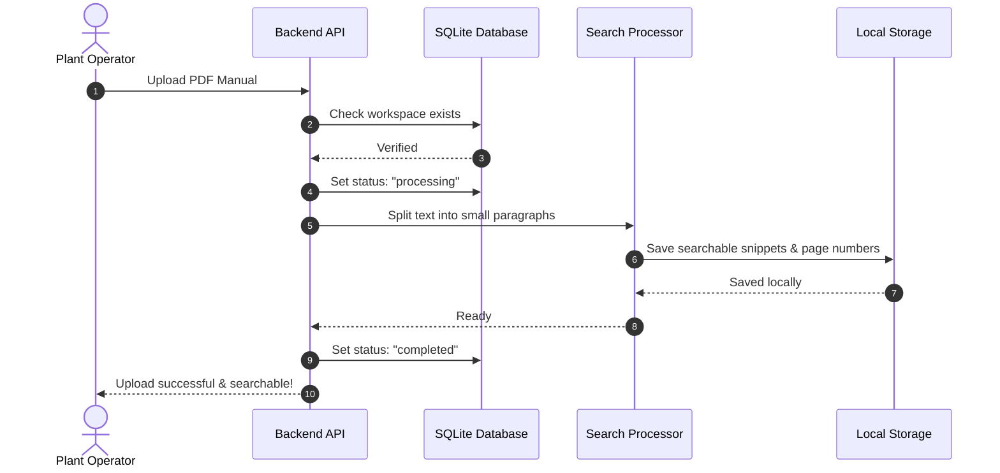

# CogniShift: Complete Team Guide & Project Encyclopedia

> **Welcome to the CogniShift Team Guide!**  
> This guide explains **what this project is**, **why we are building it**, and **how every single file in the repository works** in plain, everyday language. Whether you are writing backend code, designing the web interface, or presenting to hackathon judges, this guide gives you the whole story without confusing buzzwords.

---

## Table of Contents
1. [What is CogniShift? (The Big Picture)](#1-what-is-cognishift-the-big-picture)
2. [How It Works (The 5 Simple Parts)](#2-how-it-works-the-5-simple-parts)
3. [File-by-File Guide (What, Why, and How)](#3-file-by-file-guide)
4. [Interactive Walkthrough & Real-Life Scenarios](#4-interactive-walkthrough--real-life-scenarios)
5. [Quick Pitch Cheat Sheet for Presentations](#5-quick-pitch-cheat-sheet-for-presentations)

---

## 1. What is CogniShift? (The Big Picture)

### The Real-World Problem (MRPL Refinery)
**Mangalore Refinery and Petrochemicals Limited (MRPL)** processes crude oil using heavy machinery like distillation columns, furnaces, high-pressure pumps, and valves.

When plant technicians or shift engineers are on duty:
1. They need quick answers from massive 500-page equipment manuals, safety guidelines, and operating steps.
2. They need an intelligent assistant to help troubleshoot problems (like an unexpected drop in pipe pressure or an overheating motor).
3. **The Big Problem:** **They cannot use normal cloud tools like ChatGPT.** Sending confidential plant manuals, internal passwords, or live machine readings to the internet is a severe safety and security hazard.
4. **The Safety Problem:** An AI cannot be allowed to push buttons or change machine settings on its own without a human engineer reviewing and approving the action first.

### The Solution: CogniShift
CogniShift is a **private, offline AI assistant platform** built specifically for the plant:
* **100% Offline (No Internet Needed):** Everything runs on the company's local computer. The AI models run directly on the machine's GPU using Ollama. No data ever leaves the plant.
* **Specialized Assistants:** Instead of one generic chatbot, operators can set up focused assistants (like a *Maintenance Assistant* for machinery or an *IT Helpdesk Agent* for office issues).
* **Built-in Safety Handcuffs:** The AI can look up information and check readings automatically. But if it wants to do something risky (like opening an emergency pressure valve), it must pause and wait for a human supervisor to click "Approve."

---

## 2. How It Works (The 5 Simple Parts)

Think of CogniShift like a secure control room with five key stations:

```
+-------------------------------------------------------------------------------+
|  1. THE FRONT DESK (FastAPI / main.py)                                        |
|     Receives requests from users or web screens and routes them to the right  |
|     department.                                                               |
+---------------------------------------+---------------------------------------+
                                        |
        +-------------------------------+-------------------------------+
        |                                                               |
+-------v-------------------------------+       +-----------------------v-------+
|  2. THE FILING CABINET                |       |  3. THE MANUALS LIBRARY       |
|     (SQLite / database.py, models.py) |       |     (RAG / retriever.py)      |
|     Stores all workspaces, agents,    |       |     Reads uploaded PDFs and   |
|     tool lists, and approval history  |       |     finds the exact page with |
|     in clean local tables.            |       |     the answer in seconds.    |
+---------------------------------------+       +-------------------------------+
        |                                                               |
        +-------------------------------+-------------------------------+
                                        |
+---------------------------------------v---------------------------------------+
|  4. THE LOCAL BRAIN (core/providers.py & ollama_provider.py)                 |
|     The local AI model (Llama 3.2 for text, Moondream for photos).            |
|     Runs entirely on the local computer with zero internet cables attached.   |
+---------------------------------------+---------------------------------------+
                                        |
+---------------------------------------v---------------------------------------+
|  5. THE TOOLBOX & SAFETY HANDCUFFS (core/tools.py & approvals.py)             |
|     Allows the AI to check sensor readings safely. If an action is risky,     |
|     the system stops the AI until an engineer clicks "Approve."               |
+-------------------------------------------------------------------------------+
```

---

## 3. File-by-File Guide

Here is what every file in the project does, why we have it, and how it works:

### A. Web Server & Setup

#### 1. `src/cognishift/app/main.py`
* **What it does:** Starts the web server and hooks all the pieces together.
* **Why we have it:** The system needs one central entry door where web pages and users can talk to the backend.
* **How it works:** Uses FastAPI. When started, it makes sure storage folders exist, connects to the database, registers all API routes, and sends web browsers to the built-in operator screen at `/static/index.html`.

#### 2. `src/cognishift/app/config.py`
* **What it does:** Reads settings from the `.env` file (like model names, folder paths, and file upload limits).
* **Why we have it:** Keeping settings in one file means we can change paths or models easily without editing code.
* **How it works:** Automatically detects the main project folder so that all file paths stay accurate no matter where you launch the terminal from.

#### 3. `src/cognishift/app/static/index.html`
* **What it does:** The built-in visual control screen.
* **Why we have it:** Gives the team and presentation judges an immediate web screen to test uploading manuals, viewing text snippets, and approving or rejecting AI actions.
* **How it works:** A clean web page built with HTML and Tailwind CSS that calls our backend endpoints directly.

---

### B. Database & Data Models

#### 4. `src/cognishift/app/db/database.py`
* **What it does:** Manages our local SQLite database.
* **Why we have it:** We need fast, lightweight local storage that works offline without installing heavy database servers.
* **How it works:** Uses `aiosqlite` with WAL mode enabled so multiple tasks can read and write without locking up. Automatically sets up 8 tables:
  1. `workspaces`: Separates different plant areas (e.g., Refining Unit vs IT).
  2. `agent_definitions`: Stores each agent's name, prompt instructions, and assigned tools.
  3. `knowledge_sources`: Tracks uploaded PDF manuals and chunk counts.
  4. `tool_definitions`: Lists all plant tools and whether they require human approval.
  5. `agent_runs`: Stores queries sent to the AI and the answers produced.
  6. `run_events`: Records step-by-step logs of what the AI thought and did.
  7. `approval_requests`: Holds paused actions waiting for supervisor review.
  8. `audit_events`: Keeps a security log of important actions.

#### 5. `src/cognishift/app/db/models.py`
* **What it does:** Defines data checklists (Pydantic schemas) for all incoming and outgoing data.
* **Why we have it:** Prevents errors. If someone sends incomplete or invalid data, the system catches it immediately before it touches the database.
* **How it works:** Converts raw database rows into clean JSON responses and checks types automatically.

---

### C. API Endpoints (The Routes)

#### 6. `src/cognishift/app/api/workspaces.py`
* **What it does:** Creates and lists Workspaces (`/api/v1/workspaces`).
* **Why we have it:** Keeps different teams organized. For example, the Crude Distillation team has their own private space separate from IT support.
* **How it works:** Runs standard database queries to insert or list workspaces.

#### 7. `src/cognishift/app/api/agents.py`
* **What it does:** Creates, lists, and updates AI Agents (`/api/v1/agents`).
* **Why we have it:** Allows operators to customize assistants with specific instructions (e.g., "You are an expert on pump maintenance").
* **How it works:** Saves and updates agent settings in the database, including the list of tools the agent is permitted to use.

#### 8. `src/cognishift/app/api/knowledge.py`
* **What it does:** Handles PDF manual uploads, listings, and deletions (`/api/v1/knowledge`).
* **Why we have it:** Lets operators upload plant manuals so the AI can read them.
* **How it works:** Verifies the file is a PDF under 50MB, gives it a clean unique name, passes it to the search processor, and saves its record. Also includes a delete endpoint that cleans up both the file and its search data.

#### 9. `src/cognishift/app/api/approvals.py`
* **What it does:** The human approval inbox (`/api/v1/approvals`).
* **Why we have it:** Allows supervisors to review and approve or reject any high-risk action proposed by the AI.
* **How it works:** Shows pending approval requests, and provides buttons to approve or reject them with a timestamp and reviewer tag.

---

### D. AI Logic & Search Engine

#### 10. `src/cognishift/core/retriever.py`
* **What it does:** The offline document search engine (RAG).
* **Why we have it:** Allows the AI to search a 500-page manual in seconds and cite the exact manual name and page number in its answer.
* **How it works:**
  - Extracts text page-by-page from PDFs using `pypdf`.
  - Splits text into readable chunks with a small overlap so sentences do not get cut off.
  - Converts chunks into searchable data using **FastEmbed**, which runs on regular computer CPUs without needing internet.
  - Saves the data in **ChromaDB** on the local drive.
  - Exports `retrieve_context()` so the AI can pull relevant paragraphs and page citations (`[Manual.pdf | Page 12]`).

#### 11. `src/cognishift/core/tools.py`
* **What it does:** Safe plant tool simulations.
* **Why we have it:** Lets the AI interact with simulated equipment safely. We strictly avoid running raw operating system commands to protect the host computer from accidental damage.
* **How it works:** Exports `execute_tool(tool_name, parameters)` with realistic simulations:
  - `check_pressure`: Reports pipe pressure (e.g., 105.4 PSI - Normal).
  - `check_temperature`: Reports sensor temperature (e.g., 78.2 C - Safe).
  - `run_diagnostic`: Checks valves and sensors on a unit.
  - `emergency_pressure_relief`: Simulates opening an emergency vent valve to the flare header.
  - `restart_component`: Simulates power-cycling an industrial pump.
  - `check_network`: Checks plant network status.
  - `restart_service`: Restarts telemetry data collectors.

#### 12. `src/cognishift/core/providers.py`
* **What it does:** The blueprint and factory for AI models.
* **Why we have it:** Standardizes how the rest of the app talks to the AI. It also enforces our offline rule: external cloud models are strictly forbidden.
* **How it works:** If the app is set to local mode, it only allows the local Ollama provider or our test simulator.

#### 13. `src/cognishift/core/ollama_provider.py`
* **What it does:** Communicates with the local Ollama program running on the computer.
* **Why we have it:** Runs the actual AI models locally on our GPU without sending anything to the internet.
* **How it works:** Sends prompts to `http://localhost:11434/api/chat` using Llama 3.2 for text and Moondream for photos.

#### 14. `src/cognishift/core/simulated_provider.py`
* **What it does:** A test simulator that gives quick mock AI answers.
* **Why we have it:** Allows teammates on CPU laptops to test code, build the web interface, and run tests without needing a heavy GPU or downloading large model files.
* **How it works:** Returns labeled test text and test image responses.

---

### E. Scripts, Tests & Project Files

#### 15. `scripts/seed.py`
* **What it does:** Sets up ready-to-use sample plant data.
* **Why we have it:** Sets up Workspace 1 (*MRPL Refinery Operations*), the *Maintenance Assistant* with tools, the *IT Helpdesk Agent*, and 7 tool definitions in one click.

#### 16. `pytest.ini`
* **What it does:** Configures the automated test runner.
* **Why we have it:** Lets anyone run all tests by simply typing `pytest` in the terminal.

#### 17. `requirements.txt`
* **What it does:** Lists all Python packages needed to run the project.

#### 18. `AGENTS.md`
* **What it does:** The development contract between Sitanshu and Rohit that kept their coding work in sync without stepping on each other's toes.

#### 19. `implementation_plan.md`
* **What it does:** The master development roadmap tracking the 8 project phases.

---

## 4. Interactive Walkthrough & Real-Life Scenarios

Explore these scenarios to understand how the platform works in real situations:

<details>
<summary><b>📄 Scenario 1: Uploading a New Equipment Manual (Click to Expand)</b></summary>



**What happened:** The 50-page manual was broken into small paragraphs with page numbers, indexed on the local drive, and made searchable in seconds without using the internet.
</details>

<details>
<summary><b>🌡️ Scenario 2: Routine Query (Safe Sensor Check) (Click to Expand)</b></summary>

**Operator asks:** *"What is the current temperature reading on Thermocouple TT-204?"*

```
1. Operator types question in the console.
2. The Maintenance Assistant analyzes the query.
3. The AI chooses the tool: check_temperature(sensor_id="TT-204").
4. The system checks the tool safety level:
   - Tool: "check_temperature" -> Risk Level: Read-Only -> Needs Approval: NO.
5. Because it is safe, the system runs the tool immediately.
6. Sensor reading returned: "Thermocouple TT-204 reports temperature is 78.2 C (Safe limit: 95.0 C). Status: NORMAL."
7. The AI replies to the operator with the status.
```
</details>

<details>
<summary><b>🚨 Scenario 3: Emergency Action (High-Risk Venting with Approval) (Click to Expand)</b></summary>

**Operator asks:** *"Pressure in Reactor-B is over 500 PSI! Vent the pressure immediately!"*

```
1. Operator types emergency instruction.
2. The AI checks the manual: "Over 450 PSI requires opening safety valve SV-402."
3. The AI proposes tool: emergency_pressure_relief(chamber_id="Reactor-B").
4. The system checks the tool safety level:
   - Tool: "emergency_pressure_relief" -> Risk Level: High -> Needs Approval: YES!
5. SAFETY STOP TRIGGERED!
6. The AI pauses execution. A request is created in the Approvals Inbox:
   - Action: Emergency Pressure Relief
   - Reason: Reactor-B pressure above safe threshold
   - Status: Waiting for Supervisor
7. The shift supervisor sees the notification on their screen and clicks [APPROVE].
8. The system resumes execution and vents the valve safely:
   "[EMERGENCY OVERRIDE EXECUTED] Safety valve SV-402 on Reactor-B opened. Vented 35 PSI to flare header."
9. The event is permanently saved in the security audit log.
```
</details>

<details>
<summary><b>🎯 Scenario 4: Presentation Questions & Answers (Click to Reveal)</b></summary>

**Q: What happens if the plant has zero internet connection?**  
> *Answer:* Everything works normally. The document reader, search index, database, and local AI model run 100% on the local computer without needing an internet connection.

**Q: How do we know the AI is not making up facts?**  
> *Answer:* The AI answers using verified PDF manuals and includes the exact document name and page number for every piece of advice it gives.

**Q: Can a user trick the AI into running malicious commands on the computer?**  
> *Answer:* No. The system has zero command-line execution. All actions are simulated through safe, predefined Python functions.

**Q: Who on our team worked on what?**  
> *Answer:* Sitanshu has an NVIDIA GPU laptop and built the AI inference provider, model integration, and execution engine. Rohit has a CPU laptop and built the document search pipeline, safety approval inbox, and APIs.
</details>

---

## 5. Quick Pitch Cheat Sheet for Presentations

When explaining the project to professors or evaluators, use these clear explanations:

| Feature | What It Is | How to Explain It |
|:---|:---|:---|
| **100% Offline** | Air-Gapped Operation | *"Plant data never leaves the building. We run open-weight AI models locally on company hardware."* |
| **Document Search** | Manual Search with Page Citations | *"The AI reads equipment manuals and gives answers with exact page numbers so engineers can verify every detail."* |
| **Safe Actions** | Simulated Plant Tools | *"The AI cannot run harmful system commands. It interacts through safe, validated tool routines."* |
| **Human Approval** | Human-in-the-Loop Safety | *"The AI cannot perform risky plant actions without a supervisor reviewing and clicking Approve on their dashboard."* |
| **Fast Local Storage** | Concurrent SQLite Database | *"Lightweight, fast local database that stores history and settings without requiring complex external database servers."* |
